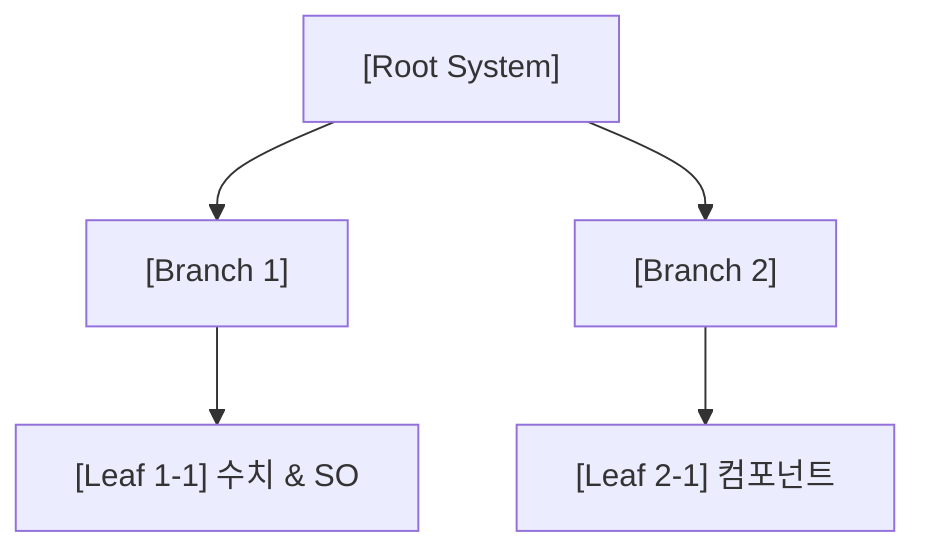

# Unity 게임 기획, 트리 분해 및 대화형 인터뷰 워크플로우

이 스킬은 Designer 에이전트가 원본 기획서를 바탕으로 **트리형 기능 분해(Feature Tree)**와 **텔레포트 이벤트(Event Portal)**를 적용하여 5대 기획 갭을 분석하고, 사용자 대화형 인터뷰를 거쳐 완결된 상세 명세서(`docs/tech_spec/`) 및 실무 태스크(`worklist.md`)를 도출하는 표준 절차를 정의합니다.

---

## 1. 기획 트리(Feature Tree) 및 텔레포트 노드 3대 원칙

Designer는 기획 분석 시 아래 3단계 노드 체계를 엄수하여 기획의 모호성을 원천 차단합니다:

1. **Root Node (최상위 시스템)**: 단일 대기능 (예: `보스 트랙터 빔 & 듀얼 파이터 시스템`)
2. **Branch Node (가지형 노드 - 중간 하위 시스템)**:
   - 상태: `Incomplete / Branching` (아직 추상적이거나 하위 질문/조건이 남아있는 상태)
   - 조치: 사용자 대화형 인터뷰를 통해 세부 Leaf 노드로 쪼개거나 확정.
3. **Leaf Node (말단 리프 노드 - 원자적 실행 단위)**:
   - 상태: `Frozen / Actionable` (더 이상 쪼갤 필요가 없는 완결된 명세)
   - **Leaf 노드의 3대 필수 조건**:
     - 1) **구체적 수치/룰셋** (속도, 지속시간, 좌표, 공식)
     - 2) **연동할 Unity 컴포넌트 및 데이터 SO** (`SO_*`, `Collider2D`, `Rigidbody2D`)
     - 3) **텔레포트 이벤트(Event Portal)**: 시스템 간 횡단 상호작용 시 발행할 C# 이벤트 신호(`GameEvents`) 및 수신처 명시

---

## 2. 5대 기획 갭(Gap) 레이더 스캔 기준표

| 검수 영역 | 점검 기준 (Checklist) | 미달 시 조치 (Gap Action) |
| :--- | :--- | :--- |
| **1. 구체적 수치 룰셋 (Metrics)** | 속도(u/s), 쿨타임(s), 가중치, HP, 점수 등 단위 수치가 명시되었는가? | 누락 수치 도출 및 대화형 인터뷰 질문 생성 |
| **2. FSM 및 엣지케이스 (State & Edge)** | 상태 전이, 화면 이탈, 피격 중 사망, 일시정지 등 예외 수칙이 있는가? | 상태 머신 다이어그램 및 예외 처리 규칙 보강 |
| **3. 데이터 드리븐 스키마 (Data SO)** | 수치가 하드코딩되지 않고 어떤 `ScriptableObject (SO_*)`로 분리되는가? | `SO_*` 필드 구조 및 데이터 에셋 명세화 |
| **4. 텔레포트 이벤트 (Event Portals)** | 타 시스템과의 횡단 상호작용이 명확한 이벤트 신호(`EVENT_*`)로 정의되었는가? | 텔레포트 신호 발행/수신처 매핑표 작성 |
| **5. 4단계 실무 태스크 매핑 (DAG Tasks)** | 아키텍처 우선 순서(인프라 ➔ 유틸 ➔ 프리팹 ➔ UI/통합)로 태스크가 정렬되었는가? | `worklist.md`에 1:1 직렬화 매핑 |

---

## 3. 대화형 기획 분석 4단계 표준 워크플로우

### [1단계: 기획서 트리 분해 및 5대 갭 스캔]
1. `docs/specs/` 원본 기획서를 읽고 `Root ➔ Branch ➔ Leaf` 구조로 트리를 분해합니다.
2. 미완성된 Branch 노드(수치 누락, 엣지케이스 미정의, 상호작용 불명확)를 식별합니다.

### [2단계: 사용자 친화적 '역질문 인터뷰' 수행]
1. 미완성 Branch 노드에 대해 사용자에게 **선택지(A/B/C)와 추천안을 포함한 객관식 인터뷰 질문**을 제시합니다:
   ```markdown
   [기획 상세화 인터뷰: [시스템명] - [미완성 노드명]]
   Q. [핵심 딜레마 및 누락된 규칙에 대한 구체적 질문]
      - (A) [추천] ... (이유: 원작 고증 및 아키텍처 안정성)
      - (B) ...
      - (C) ...
   ```
2. 사용자의 피드백을 반영하여 Branch 노드를 확정된 **Leaf Node**들로 분기시킵니다.

### [3단계: 트리 + 텔레포트 상세 명세서 작성 (`docs/tech_spec/[시스템명]_tech_spec.md`)]
모든 노드가 Leaf 노드로 수렴하면 아래 표준 템플릿으로 명세서를 작성합니다:

```markdown
# [시스템명] 상세 기획 명세서 (Specification)

## 1. 시스템 개요 및 트리 구조도 (Feature Tree)


## 2. 세부 메커니즘 및 Leaf 노드 룰셋
- (구체적 단위 수치, 계산 공식, 상태 머신 FSM, 엣지 케이스 처리 수칙)

## 3. 데이터 구조 및 컴포넌트 설계 (Data-Driven SO)
- `SO_[이름].cs` 필드 스키마 및 직렬화 바인딩 목록
- 독립 완제품 프리팹(`PF_*`) 계층 구조도 및 부착 컴포넌트

## 4. 텔레포트 이벤트 상호작용 지도 (Event Portals)
| 텔레포트 신호 (Event Signal) | 발행 조건 (Trigger) | 수신 시스템 (Subscribers) | 수행 동작 (Action) |
| :--- | :--- | :--- | :--- |
| `EVENT_[이름]` | ... | `[수신 매니저/컴포넌트]` | ... |

## 5. 4단계 실무 개발 태스크 체크리스트
- [ ] Task 1 (인프라/SO): ...
- [ ] Task 2 (코어 로직): ...
- [ ] Task 3 (완제품 프리팹): ...
- [ ] Task 4 (UI/통합 검수): ...
```

### [4단계: 기획 동결(Design Freeze) 및 `worklist.md` 등록]
1. 기획 완성도가 100% 달성되면 사용자에게 기획 동결을 알리고 `docs/work/worklist.md`에 실무 태스크를 등록합니다.
2. `docs/work/status.md`의 `**진행 상태**`를 `[Designer] 기획 동결 완료 ➔ Developer 작업 진행 가능`으로 갱신합니다.
3. `GitManager`에게 인계하여 문서를 커밋/푸시합니다.

---

## 4. 온디맨드 기획 검수 요청 처리 ("기획서 검수해줘", "기획 체크해줘")
1. `docs/specs/` 원본 기획서를 트리 분해하여 5대 갭 점검 표를 발행합니다:
   ```markdown
   ### 기획서 5대 갭 분석 및 인터뷰 보고서

   | 검수 영역 | 상태 | 미완성 브랜치 및 질문 사항 |
   | :--- | :---: | :--- |
   | **1. 구체적 수치 룰셋** | 확정 / 인터뷰필요 | ... |
   | **2. FSM 및 엣지케이스** | 확정 / 인터뷰필요 | ... |
   | **3. 데이터 SO 스키마** | 확정 / 인터뷰필요 | ... |
   | **4. 텔레포트 이벤트** | 확정 / 인터뷰필요 | ... |
   | **5. 4단계 태스크 매핑** | 확정 / 인터뷰필요 | ... |
   ```
