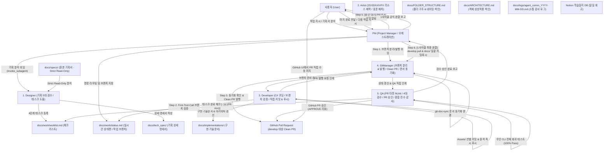
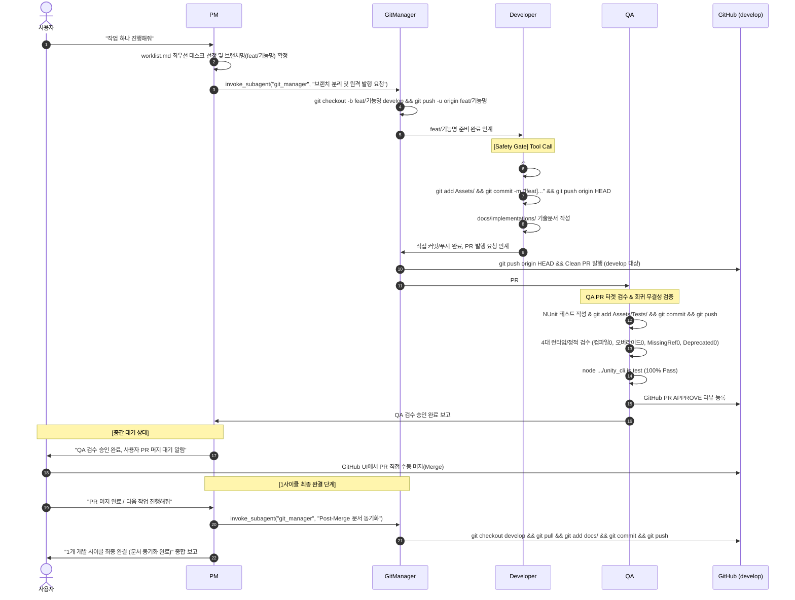

# Unity 6대 전문 에이전트 자율 협업 프레임워크 (Unity Multi-Agent Framework)

> **Antigravity AI 기반 6대 정예 에이전트 분업, 18대 전담 스킬 및 단일 거버넌스 룰 시스템**
> 기획 분석부터 AI 리소스 제작, C# 클라이언트 개발, 2-Tier 무인 QA 검증, Clean PR 발행, Git 버전 관리 및 Notion 일지 기록까지 완전 자동화된 표준 개발 라이프사이클을 제공하는 유니티 프로젝트 전용 프레임워크입니다.

---

## 1. 6대 에이전트 협업 및 라이프사이클 흐름도 (Overall Architecture)



---

## 2. 1개 개발 사이클 표준 시퀀스 (Single Task Loop Sequence)

1개의 개발 작업(Task)은 `브랜치 분리 ➔ C# 구현 & 커밋/푸시 ➔ Clean PR 발행 ➔ QA 검수 & 승인 ➔ 사용자 PR 머지 ➔ Post-Merge 문서 동기화`를 거쳐 **문서 동기화가 완료된 시점에 1사이클이 공식 완결**됩니다:



---

## 3. 에이전트 4대 공통 행동 제어 규칙 (`.agents/rules/agent_rule.md`)

모든 에이전트는 아래의 4대 거버넌스 규칙을 무조건 준수합니다:

1. **도구 우회 사용 전면 금지 (Strict Tool Discipline)**:
   - 파일 수정/생성은 오직 네이티브 도구(`write_to_file`, `replace_file_content`)만 사용하며, `unityMCP`(`apply_text_edits`, `manage_script`, `execute_code` 등)를 악용한 임의 코드 조작 및 핑퐁을 엄격히 금지합니다.
2. **단일 작업 100-Step 초과 방지 회로 차단 (Loop Circuit Breaker)**:
   - 단일 턴에서 도구 호출/스텝 수가 100회를 초과할 경우 무한 루프를 즉시 중단(Circuit Break)하고 진행 상황, 장애 원인, 차단 사유를 명시하여 보고 후 대기합니다.
3. **직무 영역 준수 및 권한 부재 시 즉시 반려 (Strict Role Boundaries & Fast-Fail)**:
   - 각 에이전트는 본인의 화이트리스트 직무만 수행하며, 권한 없는 작업이나 도구 부재 시 임의 강행하지 않고 즉시 PM에게 반려 사유를 보고합니다. (QA는 게임 코드 직접 수정 절대 금지 ➔ 즉시 QA 반려).
4. **서브 에이전트 실물 도구 호출 위임 의무화 (Mandatory Subagent Invocation)**:
   - PM은 직접 코드를 작성하거나 1인 다역으로 스킬을 열람하지 않고, 반드시 `invoke_subagent` 도구를 실제로 호출하여 독립된 전문 에이전트에게 실행을 위임합니다.

---

## 4. 6대 전문 에이전트 R&R 매트릭스

| 에이전트 | 전담 직무 라인 (`Core Scope`) | 주요 전담 스킬 (HOW) | 핵심 산출물 및 검증 게이트 |
| :--- | :--- | :--- | :--- |
| **`PM`** | • 작업 라우팅 & 브랜치 지정<br>• `invoke_subagent` 실물 위임<br>• 물리적 상태 교차 검증<br>• Post-Merge 문서 동기화 총괄 | `unity-pm-orchestration`<br>`github-issue-sync`<br>`unity-devlog-workflow` | • 종합 완료 보고서<br>• Notion 학습일지<br>• Double-Check Gate |
| **`Designer`** | • 원본 기획서(`docs/specs/`) 5대 검수<br>• 기획 상세 명세서 작성<br>• 4단계 실무 태스크 등록<br>• 기획 보완 Issue 제안 | `unity-design-workflow` | • `docs/tech_spec/`<br>• `docs/work/worklist.md`<br>• Strict Read-Only Gate |
| **`Artist`** | • 2D/3D 그래픽, UI, 오디오 제작<br>• `Assets/_Imports/` 표준 배치<br>• Particle System 완제품 프리팹 조립<br>• Animator Controller 상태 머신 구성 | `unity-art-asset-workflow`<br>`unity-vfx-anim-workflow` | • `Assets/_Imports/`<br>• `Assets/Prefabs/VFX/PF_VFX_*`<br>• Zero-Scene-VFX Gate |
| **`Developer`** | • C# 로직 신규 구현 & 수정/리팩토링<br>• Zero-Override 완제품 프리팹 조립<br>• CLI 무인 컴파일 0 에러/0 경고 검증<br>• `Assets/` 선별 커밋 & 원격 즉시 푸시<br>• 구현 기술문서 작성 | `unity-dev-workflow`<br>`unity-modify-workflow`<br>`unity-coding-rule`<br>`unity-work-rule` | • `Assets/Scripts/`<br>• `Assets/Prefabs/PF_*`<br>• `docs/implementations/`<br>• First-Tool-Call Safety Gate |
| **`QA`** | • PR 타겟 NUnit 테스트 작성 & 푸시<br>• 4대 런타임/정적 검수<br>• 무인 CLI 회귀 테스트 (100% Pass)<br>• GitHub PR `APPROVE` 리뷰 등록<br>• 프로젝트 종합 검수 & 삼각 감사 | `unity-qa-workflow`<br>`unity-qa-full-inspect`<br>`unity-spec-audit` | • `Assets/Tests/`<br>• GitHub PR Approve 리뷰<br>• Fast-Fail & Zero-Fix Gate |
| **`GitManager`** | • develop 기준 로컬 브랜치 분리 & 원격 즉시 발행<br>• develop 대상 Clean PR 발행<br>• Post-Merge `docs/` 문서 일괄 동기화<br>• GitHub Issue 4단계 상태 전이 관리 | `git-branch-setup`<br>`git-pr-workflow`<br>`git-doc-sync`<br>`github-issue-sync` | • 작업 브랜치 원격 발행<br>• Clean PR 발행<br>• Clean PR Inspection Gate |

---

## 5. 유니티 프로젝트 표준 폴더 구조 색인 ([docs/FOLDER_STRUCTURE.md](docs/FOLDER_STRUCTURE.md))

```text
Assets/
├── _Imports/               # [Git Submodule 대상] 외부 원본 리소스 (Audio, Fonts, Models, Textures)
├── Animations/             # 유니티 애니메이션 클립(Anim_*), 컨트롤러(AC_*)
├── Materials/              # 유니티 머티리얼(M_*)
├── Prefabs/                # 유니티 완제품 프리팹(PF_*) (Characters/, Items/, VFX/, UI/)
├── Scenes/                 # 씬 파일(*Scene.unity, Stage[X]-[Y].unity)
├── ScriptableObjects/      # ScriptableObject 인스턴스 에셋(SO_*)
├── Scripts/                # C# 스크립트 (Core/, Systems/, Gameplay/, UI/, Utils/)
├── Sprites/                # 유니티 스프라이트 에셋(SP_*)
├── Tests/                  # NUnit 테스트 코드 (*Tests.cs)
│   ├── Editor/             # EditMode 단위 테스트 (수식, 로직, SO 검증)
│   └── Runtime/            # PlayMode 통합 테스트 (물리, 충돌, 스폰 풀링 검증)
└── Screenshots/            # QA 검수 캡처 스크린샷
```

---

## 6. 사용자 작업 실행 명령어 빠른 참조 (Command Reference)

| 명령어 구분 | 사용자 입력 예시 | 에이전트 동작 및 처리 결과 |
| :--- | :--- | :--- |
| **단일 작업** | *"작업 하나 진행해줘"*, *"다음 작업 진행해줘"* | 브랜치 지정/발행 ➔ 개발 & 푸시 ➔ Clean PR ➔ QA 검수 & 승인 ➔ 사용자 머지 ➔ 문서 동기화 완결 |
| **배치 작업** | *"3개의 작업 진행해줘"*, *"N개의 작업 진행해줘"* | 최상위부터 N개 태스크를 순차적으로 1개 사이클씩 연계 완수 |
| **일괄 지정** | *"[키워드] 작업들 진행해줘"* | 일치하는 태스크 목록 확인 질문 ➔ 사용자 승인 후 순차 완결 |
| **이슈 동기화** | *"이슈 체크해줘"*, *"이슈 확인해줘"* | [반려] Close, [수락]➔[착수] worklist 등록, [완료] Close, [제안] 대기건수 보고 |
| **전체 전수 검수** | *"전체 검수해줘"*, *"릴리즈 검수해줘"* | QA가 전체 스크립트/씬/프리팹 Zero-Override/테스트 통계 종합 보고서 발행 |
| **정합성 감사** | *"기획/코드/문서 검수해줘"*, *"감사해줘"* | QA가 기획 ➔ 코드 ➔ 구현문서 ➔ 관계도 삼각 정합성 정밀 감사 |
| **작업 종료** | *"오늘 작업 마칠게"*, *"개발일지 작성해줘"*, *"퇴근"* | 이슈 상태 최종 점검 ➔ Notion `학습일지` DB에 자동 일지 및 토글 피드백 생성 |
