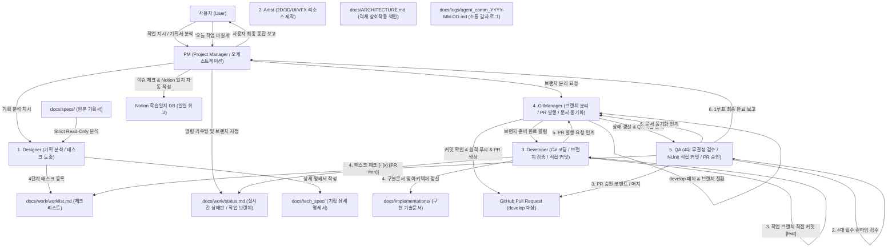
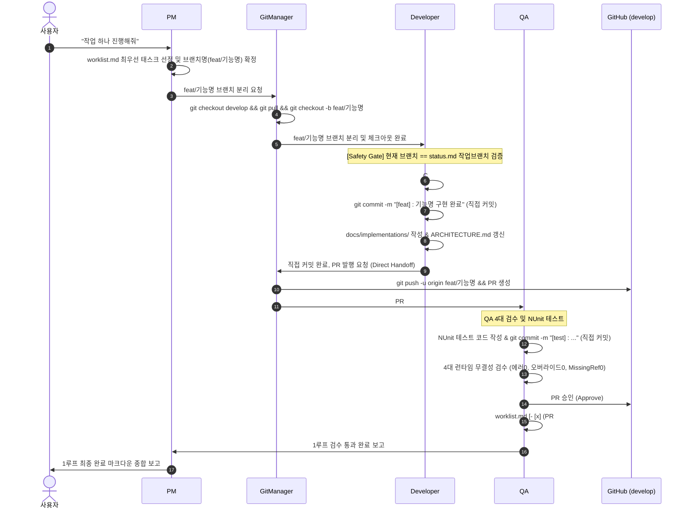

# Unity 6대 전문 에이전트 자율 협업 프레임워크 (Unity Multi-Agent Framework)

> **Antigravity AI 기반 6대 정예 에이전트 분업 및 16대 전담 스킬 시스템**
> 기획 분석부터 AI 리소스 제작, C# 개발, 무인 QA 검증, Git 버전 관리 및 Notion 일지 기록까지 완전 자동화된 사이클을 제공하는 유니티 프로젝트 표준 프레임워크입니다.

---

## 1. 6대 에이전트 협업 및 라이프사이클 흐름도 (Overall Architecture)

---

## 2. 1개 작업 단위 완결 시퀀스 (Single Task Loop Sequence)

1개의 작업(Task)은 `PM 브랜치 지정 ➔ GitManager 브랜치 분리 ➔ Developer 브랜치 검증 및 직접 커밋 ➔ GitManager PR 발행 ➔ QA 검수 및 승인 ➔ PM 종합 보고` 사이클로 완결됩니다:

---

## 3. 6대 전문 에이전트 R&R 매트릭스

| 에이전트 | 단일 전담 역할 (Single Responsibility) | 주요 전담 스킬 (HOW) | 핵심 산출물 |
| :--- | :--- | :--- | :--- |
| **`PM`** | 사용자 명령 라우팅, 브랜치 지정, 이슈 동기화, 최종 종합 보고 | `unity-pm-orchestration`, `github-issue-sync`, `unity-devlog-workflow` | 종합 보고서, Notion 일지 |
| **`Designer`** | 원본 기획서 분석, 4단계 태스크 도출, 기획 제안 | `unity-design-workflow` | `docs/tech_spec/`, `worklist.md` |
| **`Artist`** | 2D 스프라이트, UI/아이콘, Atlas, 3D, 사운드, VFX, 애니메이터 | `unity-art-asset-workflow`, `unity-vfx-anim-workflow` | `Assets/_Imports/`, `PF_VFX_*.prefab` |
| **`Developer`** | 브랜치 검증, C# 코딩/리팩토링, 직접 커밋, 구현문서 작성 | `unity-dev-workflow`, `unity-modify-workflow`, `unity-coding-rule` | C# 코드, `docs/implementations/` |
| **`GitManager`** | 브랜치 분리/전환, PR 발행, 공통 문서 동기화(Stash & Return), Issue 관리 | `git-branch-setup`, `git-pr-workflow`, `git-doc-sync` | 작업 브랜치, GitHub PR, 이슈 관리 |
| **`QA`** | NUnit 작성 및 직접 커밋, 4대 런타임 검수, PR 승인, 정합성 감사 | `unity-qa-workflow`, `unity-spec-audit` | `Assets/Tests/`, PR 승인 |

---

## 4. 사용자 작업 실행 명령어 빠른 참조 (Command Reference)

| 명령어 구분 | 사용자 입력 예시 | 에이전트 동작 및 처리 결과 |
| :--- | :--- | :--- |
| **단일 작업** | *"작업 하나 진행해줘"*, *"다음 작업 진행해줘"* | 브랜치 지정 ➔ 개발 ➔ 커밋 ➔ PR ➔ QA 검수 1루프 완결 및 종합 보고 |
| **배치 작업** | *"3개의 작업 진행해줘"*, *"N개의 작업 진행해줘"* | 최상위부터 N개 태스크를 순차적으로 1개 루프씩 연계 완수 |
| **일괄 지정** | *"[키워드] 작업들 진행해줘"* | 일치하는 태스크 목록 확인 질문 ➔ 승인 후 전체 완결 |
| **이슈 동기화** | *"이슈 체크해줘"*, *"이슈 확인해줘"* | [반려] Close, [수락]➔[착수] worklist 등록, [완료] Close, [제안] 대기건수 보고 |
| **정합성 감사** | *"기획/코드/문서 검수해줘"*, *"감사해줘"* | QA가 기획 ➔ 코드 ➔ 구현문서 ➔ 관계도 삼각 정합성 정밀 감사 |
| **작업 종료** | *"오늘 작업 마칠게"*, *"개발일지 작성해줘"*, *"퇴근"* | 이슈 상태 점검 ➔ Notion `학습일지` DB에 자동 일지 및 토글 피드백 생성 |
