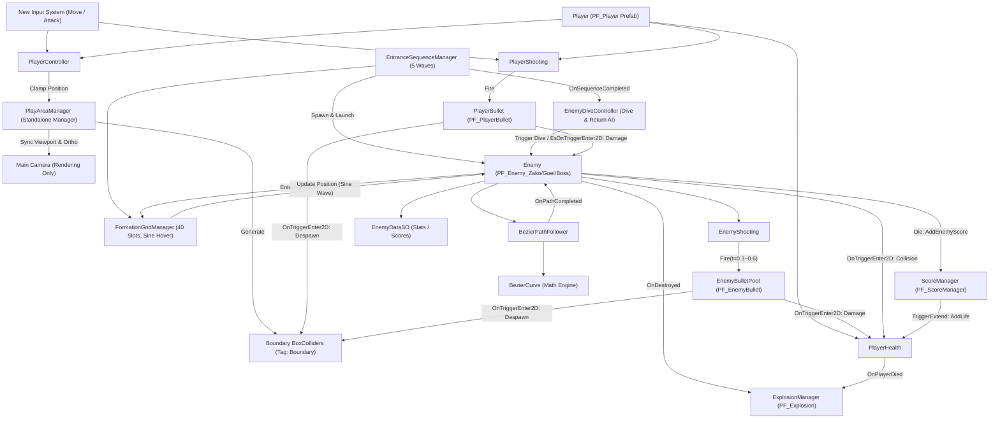

# 객체 상호작용 및 아키텍처 관계도 (Object Architecture & Interaction Map)

이 문서는 프로젝트 내 모든 게임 오브젝트 간의 상호작용, 충돌 판정, 이벤트 구독 및 데이터 참조 관계를 총괄 색인화하는 참조 전용 마스터 관계도입니다.
`Developer` 에이전트가 신규 기능을 구현할 때마다 실시간으로 관계도를 1줄씩 동기화하며, 상세한 내부 구현 스펙은 `docs/implementations/` 개별 문서를 참조합니다.

---

## 1. 객체 상호작용 매트릭스 (Interaction Matrix)

| 발신 객체 (Sender) | 수신 객체 (Receiver) | 감지 방식 (Trigger / Method) | 상호작용 내용 및 호출 메서드 |
| :--- | :--- | :--- | :--- |
| `PlayAreaManager` (독립 매니저) | `Camera` (`Main Camera`) | 직렬화 참조 (`_targetCamera`) | 3:4 타겟 해상도(224x288) 뷰포트 Rect 및 Orthographic Size(10) 동기화 |
| `PlayAreaManager` | BoundaryColliders (`Boundary` Tag) | 런타임 4방향 생성 | Left, Right, Top, Bottom 외곽 BoxCollider2D(isTrigger: true) 배치 |
| `PlayerController` (`PF_Player`) | `PlayAreaManager` | 직접 참조 / 싱글톤 인스턴스 | `ClampPosition()`을 호출하여 화면 좌우 경계 밖 이탈 방지 |
| `PlayerShooting` (`PF_Player`) | `PlayerBullet` (`PF_PlayerBullet`) | 오브젝트 풀 관리 / `TryFire()` | 화면 내 최대 2발(싱글) / 4발(듀얼) 발사 제한 및 인스턴스 활성화 |
| `PlayerBullet` (`PF_PlayerBullet`) | `PlayAreaManager` | OnTriggerEnter2D / `CheckBoundary()` | 상단 경계 도달 시 `ReturnToPool()` 호출 |
| `PlayerBullet` (`PF_PlayerBullet`) | `EnemyBase` (`PF_Enemy_*`) | OnTriggerEnter2D | `TakeDamage(1)` 호출 (HP 감소 및 0 이하 시 파괴) |
| `PlayerHealth` (`PF_Player`) | `EnemyBase` / `EnemyBullet` | OnTriggerEnter2D | 피격 감지 시 `TakeDamage(1)` 호출 (잔기 차감 및 리스폰) |
| `EnemyDiveController` | `FormationGridManager` / `EnemyBase` | 직접 참조 / 상태 변경 | 대기 적 선별 후 3차 베지어 급강하(`EnemyState.Diving`) 궤적 생성 |
| `EnemyDiveController` | `EnemyBase` (복귀) | 경로 완료 콜백 / 텔레포트 | 화면 하단 통과 시 상단 재진입 및 슬롯 복귀(`EnemyState.Returning` ➔ `EnterFormation`) |
| `EnemyShooting` (`PF_Enemy_*`) | `EnemyBulletPool` / `PlayerTransform` | `OnProgressChanged` ($t=0.3\sim 0.6$) | 다이브 중간 구간에서 플레이어 현재 위치 조준 탄환 발사 |
| `EnemyBullet` (`PF_EnemyBullet`) | `PlayerHealth` | OnTriggerEnter2D | 플레이어 충돌 시 `TakeDamage(1)` 호출 및 풀 회수 |
| `EnemyBullet` (`PF_EnemyBullet`) | `PlayAreaManager` | OnTriggerEnter2D / `CheckBoundary()` | 화면 하단 경계 이탈 시 자동 풀 반환 |
| `ExplosionManager` | `ExplosionEffect` (`PF_Explosion`) | 오브젝트 풀 관리 / 이벤트 리스너 | 적 격파(`OnDestroyed`) 및 플레이어 사망 시 `SpawnExplosion()` 호출 |
| `BezierPathFollower` | `BezierCurve` | 정적 수학 메서드 호출 | `EvaluatePath()`, `GetPathTangent()`로 위치/회전각 계산 |
| `EntranceSequenceManager` | `FormationGridManager` | 직접 참조 / 메서드 호출 | `AssignEnemyToNextAvailableSlot()`으로 슬롯 배정 및 진입 궤적 생성 |
| `FormationGridManager` | `EnemyBase` | 위치 동기화 / 상태 제어 | 슬롯 안착 적(`EnemyState.Formation`)의 위치를 Sine wave 호흡 좌표로 실시간 동기화 |
| `EnemyBase` (`PF_Enemy_*`) | `ScoreManager` (`PF_ScoreManager`) | `Die()` 직접 호출 | 격파 시 `AddEnemyScore(Type, isDiving, escortCount)` 호출하여 차등 점수 가산 |
| `ScoreManager` (`PF_ScoreManager`) | `PlayerHealth` (`PF_Player`) | `CheckExtend()` / `TriggerExtend()` | 2만/7만점 도달 시 `PlayerHealth.AddLife(1)` 호출 및 `OnExtendLife` 이벤트 발행 |

---

## 2. 2D Layer 및 Tag 충돌 매트릭스 (Collision Matrix)

| 진영 / 오브젝트 | Layer | Tag | 충돌 대상 Layer (Physics2D Matrix) | 피격 판정 인터페이스 / 방식 |
| :--- | :--- | :--- | :--- | :--- |
| 플레이어 기체 (`PF_Player`) | `Player` | `Untagged` | `Enemy` (적 기체, 적 탄환, 트랙터 빔) | `PlayerHealth.TakeDamage(1)` |
| 플레이어 탄환 (`PF_PlayerBullet`) | `Player` | `Bullet` | `Enemy` (적 기체) | `IDamageable` / `EnemyBase.TakeDamage(1)` |
| 적 기체 3종 (`PF_Enemy_*`) | `Enemy` | `Untagged` | `Player` (플레이어 탄환, 플레이어 기체) | `IDamageable` / `EnemyBase.TakeDamage(1)` |
| 적 탄환 (`PF_EnemyBullet`) | `Enemy` | `Bullet` | `Player` (플레이어 기체) | `PlayerHealth.TakeDamage(1)` |
| 화면 외곽 경계벽 (4방향) | `Default` | `Boundary` | `Player`, `Enemy` | `isTrigger = true` (탄환 풀 회수 및 좌표 클램핑) |

---

## 3. 이벤트 발행-구독 흐름도 (Event Flow)

| 이벤트 발행자 (Publisher) | 이벤트 명 (Event / Action) | 구독자 (Subscriber) | 반응 로직 (Handler Method) |
| :--- | :--- | :--- | :--- |
| `InputSystem (Player/Move)` | `ReadValue<Vector2>()` | `PlayerController` | 실시간 X축 이동 반영 |
| `InputSystem (Player/Attack)` | `performed` | `PlayerShooting` | `TryFire()` 호출하여 탄환 발사 |
| `PlayerHealth` | `OnLivesChanged(int)` | `HUD / UIManager` | 잔기 변경 시 하단 UI 아이콘 갱신 |
| `PlayerHealth` | `OnPlayerRespawned` | `PlayerController` / `Audio` | 리스폰 효과음 재생 및 기체 조작권 복구 |
| `PlayerHealth` | `OnPlayerDied` | `GameManager / ExplosionManager` | 폭발 이펙트 재생 및 게임 오버 시퀀스 트리거 |
| `ScoreManager` | `OnScoreChanged(int)` | `HUD / UIManager` | 점수 변경 시 상단 1UP 스코어 텍스트 실시간 갱신 |
| `ScoreManager` | `OnHighScoreChanged(int)` | `HUD / UIManager` | 하이스코어 갱신 시 HIGH SCORE 텍스트 실시간 반영 |
| `ScoreManager` | `OnExtendLife(int)` | `PlayerHealth / AudioManager` | 익스텐드 도달 시 보너스 잔기 지급 및 효과음 재생 |
| `BezierPathFollower` | `OnProgressChanged(float)` | `EnemyShooting` | $t=0.3\sim 0.6$ 구간 조준 사격 발사 |
| `BezierPathFollower` | `OnPathCompleted` | `EnemyBase` / `EnemyDiveController` | 진입 안착 또는 하단 루프 복귀 핸들러 실행 |
| `EnemyBase` | `OnDamaged(EnemyBase, int)` | `ScoreManager / SoundManager` | 피격 효과음 및 플래시 연출 |
| `EnemyBase` | `OnDestroyed(EnemyBase)` | `ScoreManager / FormationGridManager / ExplosionManager` | 점수 가산, 편대 슬롯 자동 해제, 폭발 이펙트 스폰 |
| `EntranceSequenceManager` | `OnSequenceCompleted` | `EnemyDiveController` | 40기 진입 완료 시 자동 다이브 루프 활성화 |

---

## 4. ScriptableObject 데이터 참조 구조 (Data Binding)

| 데이터 SO (Asset) | 참조 컴포넌트 (Consumer) | 바인딩 데이터 및 역할 |
| :--- | :--- | :--- |
| `SO_Enemy_Zako.asset` | `PF_Enemy_Zako` (`EnemyBase`) | MaxHP: 1, ScoreStay: 50, ScoreDive: 100, MoveSpeed: 10 |
| `SO_Enemy_Goei.asset` | `PF_Enemy_Goei` (`EnemyBase`) | MaxHP: 1, ScoreStay: 80, ScoreDive: 160, MoveSpeed: 11 |
| `SO_Enemy_Boss.asset` | `PF_Enemy_Boss` (`EnemyBase`) | MaxHP: 2, ScoreStay: 150, ScoreDive: 400, MoveSpeed: 9 |

---

## 5. 아키텍처 및 호출 흐름 다이어그램 (Architecture Diagram)

