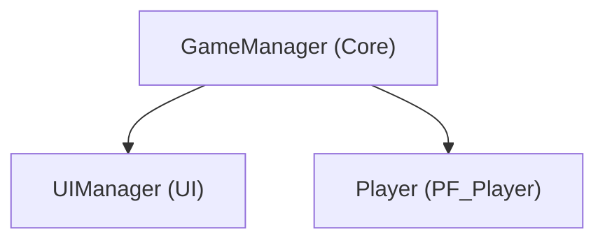

# 객체 상호작용 및 아키텍처 관계도 (Object Architecture & Interaction Map)

이 문서는 프로젝트 내 모든 게임 오브젝트 간의 충돌 상호작용, 생성 및 생명주기 관리(Spawner/Pool), 이벤트 구독 관계, Public API 계약, ScriptableObject 데이터 바인딩을 총괄 색인화하는 마스터 아키텍처 문서입니다.
`Developer`가 신규 기능을 구현할 때마다 실시간으로 갱신 관리하며, 모든 서브에이전트(`Developer`, `QA`, `PM`)는 소스 코드를 반복해서 뒤지는 대신 본 문서를 1차 참조하여 작업을 수행합니다.

---

## 1. 객체 상호작용 및 충돌 매트릭스 (Interaction Matrix)

| 발신 객체 (Sender) | 수신 객체 (Receiver) | 감지 방식 (Trigger / Collision) | 상호작용 내용 및 호출 메서드 |
| :--- | :--- | :--- | :--- |
| *(기능 구현 시 발신 객체)* | *(수신 대상 객체)* | *(OnTrigger / OnCollision)* | *(호출 로직 및 상태 변경)* |

---

## 2. 객체 생성 및 생명주기 관리 (Spawn & Lifecycle Management)

- **매니저 및 씬 싱글톤 구조**:
  - *(예: GameManager ➔ UIManager, SoundManager 생명주기 제어)*
- **오브젝트 스포너 및 풀링 구조**:
  - *(예: EnemySpawner ➔ PF_Enemy.prefab 인스턴스화 및 풀링 관리)*

---

## 3. 이벤트 구독 및 알림 흐름 (Event Flow)

| 이벤트 발행자 (Publisher) | 이벤트 명 (Event / Action) | 구독자 (Subscriber) | 반응 로직 (Handler Method) |
| :--- | :--- | :--- | :--- |
| *(이벤트 트리거 객체)* | *(Action / UnityEvent)* | *(리스너 객체)* | *(구독 해제 OnDisable 보장 여부)* |

---

## 4. 주요 클래스 Public API 계약 (API Contract)

| 클래스명 (Class) | 주요 메서드 및 프로퍼티 시그니처 | 역할 및 반환값 / 호출 시점 |
| :--- | :--- | :--- |
| *(클래스명)* | `public void TakeDamage(int amount)` | 피격 시 데미지 적용, HP 감소 및 사망 이벤트 트리거 |

---

## 5. ScriptableObject 데이터 참조 구조 (Data Binding)

| 데이터 SO (Asset) | 참조 컴포넌트 (Consumer) | 전달 데이터 및 역할 |
| :--- | :--- | :--- |
| *(SO_*.asset)* | *(데이터를 주입받는 MonoBehaviour)* | *(속도, 공격력, 설정값 등)* |

---

## 6. 아키텍처 및 호출 흐름 다이어그램 (Architecture Diagram)

