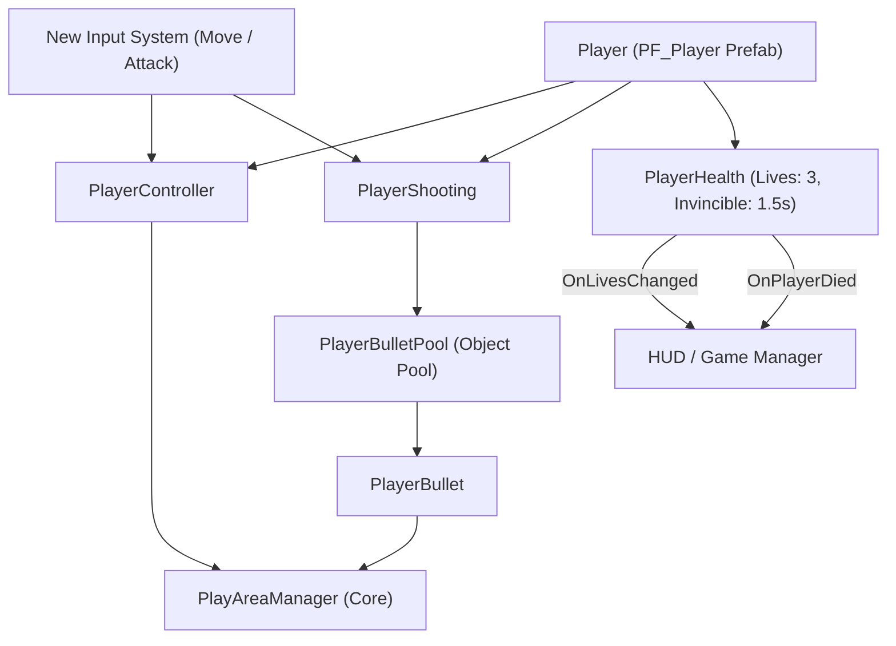

# 객체 상호작용 및 아키텍처 관계도 (Object Architecture & Interaction Map)

이 문서는 프로젝트 내 모든 게임 오브젝트 간의 충돌 상호작용, 생성 및 생명주기 관리(Spawner/Pool), 이벤트 구독 관계, ScriptableObject 데이터 바인딩을 총괄 색인화하는 마스터 아키텍처 문서입니다.
`Developer` 에이전트가 신규 기능을 구현하거나 프리팹을 조립할 때마다 실시간으로 갱신 관리합니다.

---

## 1. 객체 상호작용 및 충돌 매트릭스 (Interaction Matrix)

| 발신 객체 (Sender) | 수신 객체 (Receiver) | 감지 방식 (Trigger / Collision) | 상호작용 내용 및 호출 메서드 |
| :--- | :--- | :--- | :--- |
| `PlayerController` (`PF_Player`) | `PlayAreaManager` | 직접 참조 / 메서드 호출 | `ClampPosition()`을 호출하여 화면 좌우 경계 밖 이탈 방지 |
| `PlayerShooting` (`PF_Player`) | `PlayerBullet` (`PF_PlayerBullet`) | 오브젝트 풀 관리 / `TryFire()` | 화면 내 최대 2발(싱글) / 4발(듀얼) 발사 제한 및 인스턴스 활성화 |
| `PlayerBullet` | `PlayAreaManager` / `Enemy` | OnTriggerEnter2D / `CheckBoundary()` | 화면 상단(`MaxY`) 이탈 또는 적 피격 시 `ReturnToPool()`을 호출하여 풀 회수 |
| `PlayerHealth` (`PF_Player`) | `Enemy` / `EnemyBullet` | OnTriggerEnter2D | 피격 감지 시 `TakeDamage(1)` 호출 (무적 시 무시, 잔기 차감 후 중앙 리스폰) |
| `PlayAreaManager` (BoundaryColliders) | `Player` / `Bullet` / `Enemy` | OnTriggerEnter2D / ClampPosition / IsOutOfBounds | 플레이어 화면 이탈 방지 클램프 및 화면 외곽 탄환 소멸/적 회수 판정 |

---

## 2. 객체 생성 및 생명주기 관리 (Spawn & Lifecycle Management)

- **플레이어 완제품 프리팹 구조 (`Assets/Prefabs/PF_Player.prefab`)**:
  - `PlayerController`: 1차원 수평 이동 및 경계 클램핑 제어
  - `PlayerShooting`: 오브젝트 풀링 기반 탄환 발사 및 화면 내 2발 제한 관리
  - `PlayerHealth`: 기본 잔기 3기, 피격 시 잔기 차감, 중앙(-8Y) 리스폰 및 1.5초 무적 깜빡임 제어
- **탄환 오브젝트 풀 구조**:
  - `PlayerBulletPool`: `PlayerShooting`에 의해 사전 생성되어 활성화/비활성화 상태로 재사용 관리
- **플레이 영역 및 카메라**:
  - `PlayAreaManager`: Main Camera에 상주하며 3:4(224x288) 종횡비 뷰포트 자동 정렬 및 플레이 영역 경계 Bounds/콜라이더 생명주기 관리

---

## 3. 이벤트 구독 및 알림 흐름 (Event Flow)

| 이벤트 발행자 (Publisher) | 이벤트 명 (Event / Action) | 구독자 (Subscriber) | 반응 로직 (Handler Method) |
| :--- | :--- | :--- | :--- |
| `InputSystem (Player/Move)` | `ReadValue<Vector2>()` | `PlayerController` | `OnEnable()`/`OnDisable()`에서 액션 활성화/해제 및 실시간 X축 이동 반영 |
| `InputSystem (Player/Attack)` | `performed` | `PlayerShooting` | `OnAttackAction`에서 `TryFire()`를 호출하여 탄환 발사 |
| `PlayerHealth` | `OnLivesChanged(int)` | `HUD / UIManager` | 잔기 변경 시 하단 잔여 기수 아이콘 실시간 갱신 |
| `PlayerHealth` | `OnPlayerRespawned` | `PlayerController` / `Audio` | 리스폰 효과음 재생 및 기체 조작권 복구 |
| `PlayerHealth` | `OnPlayerDied` | `GameManager / StateDirector` | 최종 사망 시 게임 오버 결과 화면 시퀀스 트리거 |
| `PlayerBullet` | `_onDeactivatedCallback` | `PlayerShooting` | 탄환 풀 회수 시 활성 탄환 목록에서 제거하여 발사 슬롯 반환 |
| `PlayAreaManager` | `RecalculateBounds()` | `Camera` / `BoundaryColliders` | 해상도 변경 시 카메라 Rect 및 외곽 충돌체 재배치 |

---

## 4. ScriptableObject 데이터 참조 구조 (Data Binding)

| 데이터 SO (Asset) | 참조 컴포넌트 (Consumer) | 전달 데이터 및 역할 |
| :--- | :--- | :--- |
| *(차기 태스크에서 적/플레이어 스탯 SO 추가 예정)* | - | - |

---

## 5. 아키텍처 및 호출 흐름 다이어그램 (Architecture Diagram)

