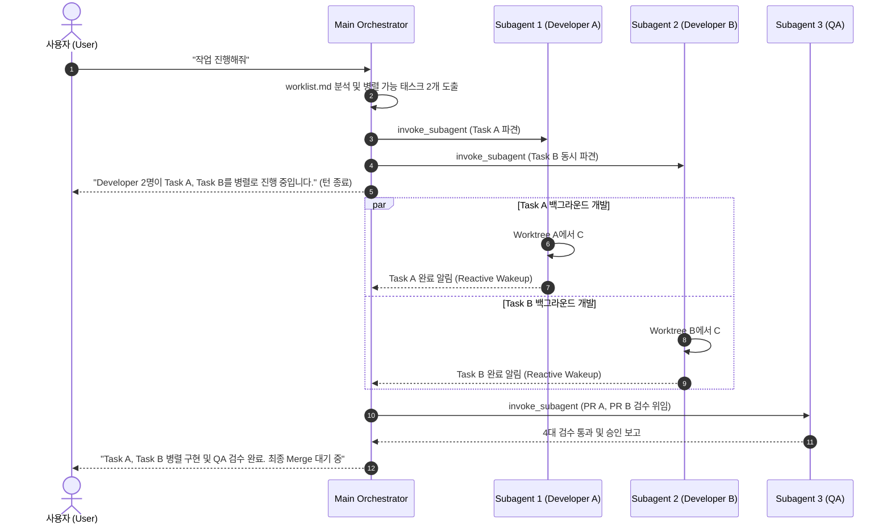

# 멀티 에이전트 실질 위임 및 병렬 실행 표준 가이드 (Parallel Agent Orchestration Guide)

이 문서는 Antigravity 멀티 에이전트 시스템에서 메인 오케스트레이터(Orchestrator)가 전담 5대 서브에이전트(`designer`, `artist`, `developer`, `git_manager`, `qa`)에게 업무를 실질적으로 위임하고, 독립적인 일감을 병렬(Parallel)로 스폰하여 개발 효율성을 극대화하는 표준 운영 가이드입니다.

---

## 1. 메인 오케스트레이터 기본 원칙 (Orchestrator Principles)

### 1.1 직접 구현 금지 (No Direct Execution by Main Agent)
* 메인 에이전트는 코드 작성기(`write_to_file`, `replace_file_content`), 유니티 씬 제어기(`call_mcp_tool unityMCP`), 버전 관리자(`call_mcp_tool github`)를 직접 호출하여 게임 기능을 자체 구현하지 않습니다.
* 메인 에이전트의 유일한 역할은 **사용자의 요구사항 해석, 작업 목록 관리(`worklist.md`), 그리고 `invoke_subagent` 도구를 통한 전문 서브에이전트 호출 및 지휘(Orchestration)**입니다.

### 1.2 서브에이전트 실질 위임 (Mandatory Subagent Invocation)
* 모든 실제 작업은 **`invoke_subagent` 도구를 호출하여 백그라운드 독립 컨텍스트를 가진 서브에이전트에게 전담 위임**합니다.
* 서브에이전트에게 명확한 역할(Role), 시스템 지침 파일 경로, 대상 태스크 및 기대 산출물을 명시하여 파견합니다.

---

## 2. 병렬 작업 우선 분배 원칙 (Parallel by Default)

### 2.1 병렬 파견 조건 (Concurrency Triggers)
`docs/work/worklist.md`에서 아래 조건 중 하나를 만족할 때, `invoke_subagent`의 `Subagents` 배열에 복수(2개 이상)의 에이전트를 동시에 담아 병렬로 가동합니다:

1. **상호 독립적인 기능 개발 (Independent Features)**:
   - 서로 다른 C# 클래스나 모듈을 다루어 코드 충돌이 없는 태스크 2개 이상이 대기 중일 때
   - *예: Task 1-3(탄환 오브젝트 풀) + Task 2-1(3차 베지어 곡선 엔진)*
2. **이종 전문 에이전트 협업 (Cross-Discipline Collaboration)**:
   - `Artist`의 리소스 제작(스프라이트, 파티클 이펙트 프리팹)과 `Developer`의 로직 구현이 동시에 필요할 때
3. **개발 및 선행 조사/기획 병렬 진행 (Dev + Research/Design)**:
   - `Developer`가 현재 기능을 코딩하는 동안, `Designer` 또는 `Research`가 다음 Phase의 세부 기획/수식을 선행 분석할 때

### 2.2 병렬 파견 도구 호출 규격 (Tool Invocation Format)

```json
{
  "Subagents": [
    {
      "TypeName": "developer",
      "Role": "Bullet System Developer",
      "Prompt": "Task 1-3: 플레이어 탄환 오브젝트 풀 및 발사 메커니즘을 feat_bullet_system 브랜치에서 구현하고 NUnit 테스트를 작성하세요."
    },
    {
      "TypeName": "developer",
      "Role": "Bezier Engine Developer",
      "Prompt": "Task 2-1: 3차 베지어 곡선 궤적 이동 엔진 라이브러리를 feat_bezier_engine 브랜치에서 구현하고 NUnit 테스트를 작성하세요."
    }
  ]
}
```

---

## 3. Git Worktree 및 Unity 충돌 방지 아키텍처

병렬로 파견된 에이전트들이 서로 충돌하지 않고 안정적으로 작업할 수 있도록 아래의 격리 원칙을 준수합니다:

1. **Git Worktree 완전 격리**:
   - 병렬 파견된 각 Developer는 상위 디렉토리의 독립된 워크트리(`../[ProjectName]_worktrees/feat_[기능명]`)에서 작업하여 파일 덮어쓰기 충돌을 원천 차단합니다.
2. **독립 모듈 우선 개발**:
   - 병렬 개발 단계에서는 공용 씬(`MainGameScene.unity`) 수정을 지양하고, 순수 C# 컴포넌트, 독립 프리팹(`PF_*`), NUnit EditMode 테스트 스크립트 위주로 구현합니다.
3. **씬 통합 및 검수는 순차 처리**:
   - 각 브랜치의 PR이 생성되면, `QA`가 순차적으로 씬에 바인딩하고 런타임 검수를 수행합니다.

---

## 4. 서브에이전트 생명주기 및 관찰 워크플로우



---

## 5. 결론 및 적용 효과

* **작업 속도 N배 향상**: 독립적인 태스크들을 동시 진행하여 개발 소요 시간 대폭 단축
* **명확한 역할 분담**: 오케스트레이터는 지휘와 검토에 집중하고, 서브에이전트는 전문 구현에 전념
* **투명한 진행 모니터링**: 사용자는 각 서브에이전트가 어떤 일감을 맡아 진행 중인지 실시간으로 파악 가능
