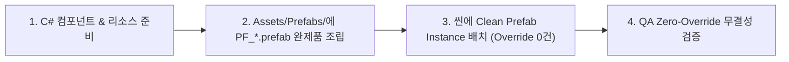

# Zero-Override 프리팹 우선 정책 및 운영 가이드 (Zero-Override Prefab-First Guide)

이 문서는 Unity 프로젝트에서 씬(Scene) 파일의 직렬화 오염과 Git 충돌을 원천 차단하고, 모든 게임 요소를 완전 조립된 독립 에셋 형태로 관리하기 위한 **Zero-Override 프리팹 우선 정책(Zero-Override Prefab-First Policy)**의 표준 가이드입니다.

---

## 1. 정책 개요 및 도입 목적 (Overview & Motivation)

### 1.1 배경 문제점
* 씬 내부에 일반 GameObject(Non-prefab)를 임의로 배치하거나, 프리팹을 배치한 후 인스펙터에서 프로퍼티를 개별 수정(Prefab Override)하면:
  1. `MainGameScene.unity` 파일 내부에 대량의 직렬화 차이점(Overrides/AddedComponents)이 기록되어 Git 충돌 위험이 급증합니다.
  2. 프리팹 에셋 원본이 수정되더라도 씬의 오버라이드된 인스턴스에 반영되지 않아 데이터 불일치 버그가 발생합니다.
  3. 다른 씬이나 런타임 스폰(Object Pool, Spawner) 시 동일한 설정을 재사용할 수 없게 됩니다.

### 1.2 핵심 원칙
* **모든 씬 배치 오브젝트는 반드시 `Assets/Prefabs/PF_[이름].prefab` 에셋 파일로 먼저 완전 조립되어 저장**되어야 합니다.
* **씬에 배치된 인스턴스는 어떠한 로컬 수정도 가하지 않은 순수 프리팹 완제품(Zero-Override Clean Prefab Instance)** 상태를 유지해야 합니다.

---

## 2. 3단계 표준 프리팹 개발 워크플로우 (3-Step Workflow)



### Step 1. C# 컴포넌트 및 종속 리소스 준비
* 런타임 제어에 필요한 C# 컴포넌트(`PlayerController`, `PlayerShooting` 등)와 메쉬, 파티클, 애니메이터를 준비합니다.

### Step 2. `Assets/Prefabs/` 폴더에 완제품 프리팹 에셋 생성
* 빈 GameObject 또는 프리미티브를 생성하고 필요한 모든 컴포넌트(`MonoBehaviour`, `Collider2D`, `MeshRenderer`, 직렬화 바인딩 등)를 완벽하게 조립합니다.
* `Assets/Prefabs/PF_[이름].prefab` 경로에 에셋으로 영구 저장합니다.

### Step 3. 씬에 Zero-Override 인스턴스 배치
* 씬에는 Step 2에서 생성된 프리팹 에셋을 인스턴스화하여 배치합니다.
* 배치 후 씬 인스펙터에서 개별 필드를 수정하지 않으며, 수정이 필요할 경우 반드시 **프리팹 에셋 원본(Prefab Asset Root)**을 수정하여 모든 인스턴스에 동기화합니다.

---

## 3. 에이전트 역할별 책임 및 검증 기준 (Role Responsibilities)

### 3.1 Developer (개발자)
* 씬 로컬 게임오브젝트를 씬에 직접 잔류시키는 행위 금지
* 신규 게임 객체(Player, Enemy, Spawner, Bullet, HUD 등) 구현 시 반드시 `PF_*.prefab` 에셋을 생성하고 `.meta` 파일과 함께 커밋
* 씬 배치 시 프리팹 오버라이드 0건 유지

### 3.2 QA (품질 보증)
* **4대 검수 2단계 필수 항목**:
  1. 씬 내의 모든 오브젝트가 실제 `Assets/Prefabs/` 내의 프리팹 에셋과 연결되어 있는지 확인
  2. 인스펙터 상의 프리팹 오버라이드(Overrides)가 존재하는 경우 즉시 **QA 반려(Reject)** 처리하고 Developer에게 원본 프리팹 수정 요청

---

## 4. Unity MCP 프리팹 생성/인스턴스화 예시

```json
// 1. 프리팹 에셋 생성 (manage_prefabs)
{
  "action": "create",
  "prefab_path": "Assets/Prefabs/PF_Player.prefab",
  "source_gameobject": "Player_Draft"
}

// 2. 씬에 Clean Prefab 인스턴스 배치
{
  "action": "instantiate",
  "prefab_path": "Assets/Prefabs/PF_Player.prefab",
  "parent": null,
  "position": { "x": 0.0, "y": -8.0, "z": 0.0 }
}
```
