# [Implementation] Task 5-2: 플레이어 기체 포획(Captured Fighter) 4단계 시퀀스 구현

## 1. 개요 및 구현 목표
본 문서는 Galaga의 핵심 메카닉인 보스 갤러그의 트랙터 빔 피격에 따른 **플레이어 기체 포획 4단계 시퀀스**의 C# 아키텍처 및 세부 구현 명세를 기술합니다.
트랙터 빔 접촉 순간부터 조작 박탈, 360도 스핀 회전, 보스 상단 슬롯 견인, 포획 적군 틴트 반전, 보스 상단 슬롯 결속, 잔기 차감 및 차기 기체 출격(또는 게임 오버)까지의 전 과정을 모듈화하여 무결성을 확보했습니다.

---

## 2. 4단계 포획 시퀀스 파이프라인

```mermaid
sequenceDiagram
    participant Player as PF_Player (PlayerController)
    participant Beam as BossTractorBeam
    participant CaptureCtrl as FighterCaptureController
    participant Boss as EnemyBoss
    participant Captured as CapturedFighter

    Beam->>Player: OnTriggerEnter2D (트랙터 빔 접촉 감지)
    Beam->>CaptureCtrl: StartCaptureSequence(Player, Beam, Boss)
    
    rect rgb(30, 40, 60)
        Note over CaptureCtrl, Player: Phase 1: 조작 상실 (0.0s ~ 0.2s)
        CaptureCtrl->>Player: CanMove = false, CanShoot = false, IsInvincible = true
        CaptureCtrl->>Player: X좌표 빔 중심축으로 보간
    end

    rect rgb(40, 50, 80)
        Note over CaptureCtrl, Player: Phase 2: 스핀 회전 및 중심 정렬 (0.2s ~ 1.2s)
        CaptureCtrl->>Player: Z축 360도 연속 회전 (720 deg/s)
        CaptureCtrl->>Player: X좌표 완전 정렬 및 Y좌표 상향 견인 (+1.5 u/s)
    end

    rect rgb(60, 40, 60)
        Note over CaptureCtrl, Player: Phase 3: 상단 견인 및 색상 반전 (1.2s ~ 2.2s)
        CaptureCtrl->>Player: 회전 리셋 및 보스 상단 슬롯으로 Lerp 견인
        CaptureCtrl->>Player: 스프라이트 색상 반전 (기본 흰색 -> 포획 적색 틴트)
    end

    rect rgb(40, 60, 40)
        Note over CaptureCtrl, Boss: Phase 4: 편대 결속 및 차기 기체 출격 (2.2s ~ 3.0s)
        CaptureCtrl->>Beam: DeactivateBeam()
        CaptureCtrl->>Boss: StopTractorBeam()
        CaptureCtrl->>Captured: Create & Initialize(Boss)
        CaptureCtrl->>Boss: AttachCapturedFighter(Captured)
        CaptureCtrl->>Player: DeductLifeOnCapture() (CurrentLives--)
        alt CurrentLives > 0
            CaptureCtrl->>Player: RespawnNextFighter() (하단 리스폰, 조작권 회복, 무적 부여)
        else CurrentLives == 0
            CaptureCtrl->>Player: HandleDeath() / GameOver
        end
    end
```

---

## 3. 핵심 컴포넌트별 세부 구현 사양

### 3.1 `FighterCaptureController.cs`
* **역할**: 4단계 포획 시퀀스를 전담 제어하는 상태 머신 및 코루틴/수동 틱 컨트롤러.
* **주요 상태 열거형 (`CapturePhase`)**:
  * `Phase1_ControlLoss` (0.2초): 입력 즉시 차단, 이동 정지, 무적 플래그 부여.
  * `Phase2_SpinAlign` (1.0초): Z축 회전 애니메이션 (`_spinSpeed = 720.0f`), 빔 중심 X 정렬 및 서서히 상승.
  * `Phase3_TractorPull` (1.0초): 보스 상단 슬롯 위치로 선형 보간, 스프라이트 색상을 포획 적군 색상(`Color(1.0f, 0.35f, 0.35f, 1.0f)`)으로 틴트.
  * `Phase4_FormationBind` (0.8초): 보스 상단 슬롯 결속, 트랙터 빔 비활성화, 잔기 차감 및 차기 기체 출격.
* **주요 메서드**:
  * `StartCaptureSequence(PlayerController player, BossTractorBeam beam, EnemyBoss boss)`: 포획 시퀀스 개시
  * `CancelCaptureSequence()`: 보스 격파 등 예외 시 조작권 즉시 원복
  * `UpdateSequence(float deltaTime)`: 외부 수동 틱 및 단위 테스트 지원
  * `RespawnNextFighter()`: 잔기가 남았을 때 하단 중앙 재배치, 조작권 복구 및 무적 깜빡임 활성화

### 3.2 `CapturedFighter.cs`
* **역할**: 보스 상단 슬롯에 결속되는 적 상태의 포획기 엔티티.
* **주요 기능**:
  * `EnemyBase` 기반으로 적군 생명주기 관리 (`EnemyType.CapturedFighter`).
  * `AttachToBossSlot(Transform slot)`: 보스 상단 슬롯 트랜스폼에 부모-자식 바인딩.
  * `ApplyCapturedVisual()` / `ApplyRescuedVisual()`: 포획 적군 틴트 및 구출 복구 색상 관리.
  * 향후 Task 5-3(3대 구출 분기 판정)의 기반 인터페이스 제공.

### 3.3 `PlayerController.cs` & `PlayerShooting.cs` & `PlayerHealth.cs` 확장
* **`PlayerController`**: `CanMove`, `CanControl` 프로퍼티 추가 및 포획 중 입력 무시/수평 이동 중단.
* **`PlayerShooting`**: `CanFire` 프로퍼티 추가 및 포획 중 탄환 발사 차단.
* **`PlayerHealth`**: `DeductLifeOnCapture()` 메서드 추가로 기체 포획 시의 안전한 잔기 차감 및 게임 오버 연동.
* **`BossTractorBeam`**: `OnTriggerEnter2D`에서 플레이어 감지 시 `FighterCaptureController.Instance.StartCaptureSequence()` 자동 연동.

---

## 4. 단위 테스트 검증 결과 (`FighterCaptureSequenceTests.cs`)

총 184개 전체 NUnit EditMode 테스트(포획 시퀀스 10개 신규 테스트 포함) 100% 통과 (0건 실패):
1. `FighterCaptureController_InitialState_IsNotCapturingAndPhaseNone`: 초기 상태 검증
2. `FighterCaptureController_StartCaptureSequence_EntersPhase1_DisablesPlayerControlAndEnablesInvincible`: Phase 1 조작 차단 및 무적 검증
3. `FighterCaptureController_Phase1_InterpolatesPlayerPositionTowardsBeamCenterX`: Phase 1 빔 중심 X축 이동 검증
4. `FighterCaptureController_Phase1ToPhase2_TransitionsAccurately`: Phase 1 ➔ Phase 2 시간 전이 검증
5. `FighterCaptureController_Phase2_RotatesZAxisAndPullsUpward`: Phase 2 Z축 회전 및 Y축 상승 검증
6. `FighterCaptureController_Phase2ToPhase3_TransitionsAndInvertsColor`: Phase 3 상단 견인 및 틴트 색상 반전 검증
7. `FighterCaptureController_Phase3ToPhase4_BindsToBossSlot_AndDeductsLife`: Phase 4 보스 슬롯 결속, 트랙터 빔 회수, 잔기 차감 검증
8. `FighterCaptureController_CompleteCaptureSequence_WhenLivesRemain_RespawnsPlayerAndRestoresControl`: 잔기 잔여 시 차기 기체 출격 및 조작권 회복 검증
9. `FighterCaptureController_CompleteCaptureSequence_WhenLastLife_TriggersDeath`: 잔기 소진 시 게임 오버 상태 검증
10. `FighterCaptureController_CancelCaptureSequence_RestoresPlayerControl`: 비정상 취소 시 플레이어 복구 검증
11. `CapturedFighter_InitializeAndAttachToSlot_ManagesStateAndVisual`: 포획기 슬롯 바인딩 및 렌더링 검증

---

## 5. 변경 및 신규 파일 목록
* **신규 생성**:
  * `Assets/Scripts/Gameplay/Player/FighterCaptureController.cs`
  * `Assets/Scripts/Gameplay/Enemy/CapturedFighter.cs`
  * `Assets/Tests/Editor/FighterCaptureSequenceTests.cs`
* **수정**:
  * `Assets/Scripts/Gameplay/Enemy/EnemyType.cs` (`CapturedFighter = 3` 추가)
  * `Assets/Scripts/Gameplay/Enemy/EnemyBase.cs` (`ApplyColor` public 전환)
  * `Assets/Scripts/Gameplay/Enemy/BossTractorBeam.cs` (`FighterCaptureController` 연동)
  * `Assets/Scripts/Gameplay/Player/PlayerController.cs` (`CanMove`, `CanControl` 추가)
  * `Assets/Scripts/Gameplay/Player/PlayerShooting.cs` (`CanFire` 추가)
  * `Assets/Scripts/Gameplay/Player/PlayerHealth.cs` (`DeductLifeOnCapture` 추가)
  * `docs/ARCHITECTURE.md` (상호작용 매트릭스 갱신)
