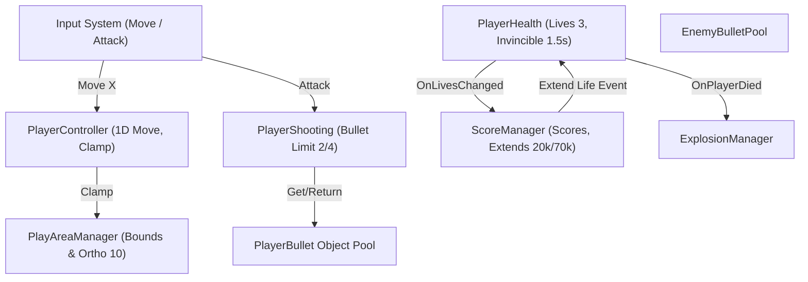

# [Tech Spec 01] 시스템 메커니즘 기술 명세서 (System Mechanics Tech Spec)

## 1. 개요 및 아키텍처 구조

본 문서는 Galaga의 플레이어 조작, 탄환 발사 풀링, 잔기 및 무적, 스코어/익스텐드, 충돌 판정 매트릭스를 C# 및 Unity 2D 환경에서 오차 없이 구현하기 위한 개발자용 심층 기술 명세서입니다.



---

## 2. 화면 좌표계 및 유닛 환산 규격 (Coordinate & Unit Standard)

### 2.1 화면 규격 및 단위 변환
* **기준 해상도**: $224 \times 288 \text{ px}$ (종횡비 $3:4 = 0.7778$)
* **카메라 Orthographic Size**: $10.0 \text{ units}$
* **월드 화면 높이 ($H_{world}$)**: $10.0 \times 2 = 20.0 \text{ units}$ (Y: $-10.0 \sim +10.0$)
* **월드 화면 너비 ($W_{world}$)**: $20.0 \times \frac{224}{288} \approx 15.5556 \text{ units}$ (X: $-7.7778 \sim +7.7778$)
* **픽셀-유닛 변환 계수 ($PPU$)**:
  $$\text{Scale Factor} = \frac{288 \text{ px}}{20.0 \text{ units}} = 14.4 \text{ px/unit} \quad \left(1 \text{ unit} = 14.4 \text{ px}, \quad 1 \text{ px} \approx 0.06944 \text{ unit}\right)$$

### 2.2 물리/속도 단위 환산표

| 항목 | 기획 기준 (px/sec) | 월드 환산 (units/sec) | 비고 |
| :--- | :---: | :---: | :--- |
| **플레이어 수평 속도** | $150 \text{ px/s}$ | $\approx 10.42 \text{ u/s}$ | $224\text{px}$ 횡단에 약 $1.49$초 소요 |
| **플레이어 미사일 속도** | $400 \text{ px/s}$ | $\approx 27.78 \text{ u/s}$ | 화면 전체 수직 횡단에 약 $0.72$초 소요 |
| **적 탄환 탄속 (최저~최고)** | $160 \sim 300 \text{ px/s}$ | $11.11 \sim 20.83 \text{ u/s}$ | 난이도 랭크에 따라 가변 |
| **적 비행 속도 (최저~최고)** | $120 \sim 250 \text{ px/s}$ | $8.33 \sim 17.36 \text{ u/s}$ | 난이도 랭크에 따라 가변 |

---

## 3. 플레이어 시스템 (Player System)

### 3.1 1D 수평 이동 및 경계 클램핑 (`PlayerController.cs`)
* **이동 축**: X축 1차원 이동만 지원 (Y축 좌표는 $-8.0 \text{ units}$ 최하단에 절대 고정).
* **입력 처리**: Unity New Input System의 `InputAction` (`Vector2`)에서 `x` 컴포넌트만 추출하여 속도 적용.
* **경계 클램프 계산 수식**:
  $$X_{clamped} = \text{Mathf.Clamp}(X_{current} + v_x \cdot \Delta t, \; X_{min} + \text{HalfWidth}, \; X_{max} - \text{HalfWidth})$$
  * $X_{min} = -7.7778$, $X_{max} = +7.7778$
  * 싱글 파이터 $\text{HalfWidth} = \frac{12 \text{ px}}{2 \times 14.4} \approx 0.4167 \text{ units}$
  * 듀얼 파이터 $\text{HalfWidth} = \frac{26 \text{ px}}{2 \times 14.4} \approx 0.9028 \text{ units}$
* **조작권 플래그 (`CanMove`)**:
  * 포획 시퀀스 진행 중, 리스폰 시 출격 애니메이션 중, 게임 오버 시 `false`로 설정하여 조작 차단.

### 3.2 탄환 발사 메커니즘 (`PlayerShooting.cs`)
* **발사 키**: `Player/Attack` (스페이스바 / 패드 버튼) 누름 감지 시 `TryFire()` 호출.
* **화면 내 탄환 수 제한 (Screen Bullet Limit)**:
  * 싱글 파이터: 화면 내 최대 **2발** 동시 존재 가능 (`_maxActiveBullets = 2`).
  * 듀얼 파이터: 화면 내 최대 **4발** 동시 존재 가능 (`_maxActiveBullets = 4`).
  * `_activeBulletCount < _maxActiveBullets` 조건을 만족할 때만 신규 탄환 발사.
* **발사 위치 오프셋**:
  * 싱글 파이터: 기체 중심 상단 $(X_0, Y_0 + 0.5 \text{ u})$에서 1발 발사.
  * 듀얼 파이터: 좌측 포대 $(X_0 - 0.45 \text{ u}, Y_0 + 0.5 \text{ u})$ 및 우측 포대 $(X_0 + 0.45 \text{ u}, Y_0 + 0.5 \text{ u})$에서 **2발 동시 발사** (발사 카운트 +2).
* **탄환 이동 및 물리 (`PlayerBullet.cs`)**:
  * `Rigidbody2D` 기반 이동: `rb.velocity = new Vector2(0f, 27.78f)`
  * `CollisionDetectionMode2D.Continuous` 적용으로 고속 이동 시 적 기체 터널링 방지.
  * 화면 상단 초과 판정: $Y > 10.5 \text{ units}$ 도달 시 또는 적 기체 충돌 시 `ReturnToPool()` 호출.

### 3.3 잔기 관리 및 리스폰/무적 시퀀스 (`PlayerHealth.cs`)
* **기본 잔기**: 시작 시 기본 3기 (플레이 중 1기 + 대기 2기).
* **피격 및 데미지 파이프라인**:
  1. 무적 상태(`IsInvincible == true`)일 경우 데미지 무시.
  2. 피격 발생 시 즉시 `CanControl = false`, `Collider2D.enabled = false`.
  3. `ExplosionManager.Instance.SpawnExplosion(transform.position, ExplosionType.Player)` 호출 (십자 불꽃 이펙트).
  4. 잔기 1 감소 (`CurrentLives--`), `OnLivesChanged?.Invoke(CurrentLives)` 이벤트 발행.
  5. 잔기 판정:
     * `CurrentLives > 0`: 1.0초 대기 후 리스폰 시퀀스 시작.
     * `CurrentLives == 0`: `OnPlayerDied?.Invoke()` 이벤트 발행 ➔ 게임 오버 시퀀스 진입.
* **리스폰 시퀀스**:
  * 리스폰 위치: $(0.0, -8.0, 0.0)$
  * **무적 시간**: $1.5\text{초}$ 동안 스프라이트 렌더러가 $0.1\text{초}$ 간격으로 알파값 $(1.0 \leftrightarrow 0.2)$ 깜빡임.
  * 무적 시간 동안 사격 및 이동은 즉시 활성화됨 (`CanControl = true`, 콜라이더는 $1.5\text{초}$ 후 활성화).

---

## 4. 점수 산정 및 익스텐드 시스템 (Score & Extends)

### 4.1 점수 테이블 명세 (`ScoreManager.cs`)

| 적 유형 / 상태 | 기본 점수 | 비행/강하 중 점수 | 특수 조건 점수 |
| :--- | :---: | :---: | :--- |
| **자코 (Zako)** | 50 | 100 | - |
| **고에이 (Goei)** | 80 | 160 | - |
| **보스 갤러그 (Boss Galaga)** | 150 | - | • 단독 다이브 격파: **400점**<br>• 호위기 1기 동반 격파: **800점**<br>• 호위기 2기 동반 격파: **1,600점** |
| **변신 적 (Transform Enemy)** | 100 | 200 | 편대 3기 완파 시 **1,000 ~ 3,000점** |
| **포획된 아군 파이터 격파** | - | 1,000 | 적 상태로 자폭 강하 시 격파 점수 |
| **챌린징 스테이지 기체** | 100 | 100 | 40기 완파(PERFECT) 시 **10,000점** |

### 4.2 익스텐드 (보너스 잔기) 계산 알고리즘
```csharp
public class ScoreManager : MonoBehaviour
{
    public static ScoreManager Instance { get; private set; }

    [SerializeField] private int _firstExtendScore = 20000;
    [SerializeField] private int _repeatExtendInterval = 70000;

    private int _currentScore = 0;
    private int _highScore = 30000;
    private int _nextExtendScore = 20000;
    private bool _hasFirstExtend = false;

    public event Action<int> OnScoreChanged;
    public event Action<int> OnHighScoreChanged;
    public event Action OnExtendEarned;

    public void AddScore(int amount)
    {
        _currentScore += amount;
        OnScoreChanged?.Invoke(_currentScore);

        if (_currentScore > _highScore)
        {
            _highScore = _currentScore;
            OnHighScoreChanged?.Invoke(_highScore);
        }

        CheckExtend();
    }

    private void CheckExtend()
    {
        if (!_hasFirstExtend && _currentScore >= _firstExtendScore)
        {
            _hasFirstExtend = true;
            _nextExtendScore = 70000;
            TriggerExtend();
        }
        else if (_hasFirstExtend && _currentScore >= _nextExtendScore)
        {
            _nextExtendScore += _repeatExtendInterval;
            TriggerExtend();
        }
    }

    private void TriggerExtend()
    {
        OnExtendEarned?.Invoke();
        SoundManager.Instance?.PlaySFX(SFXType.ExtendLife);
    }
}
```

---

## 5. 진영 레이어(Faction Layer) 및 통합 태그 기반 충돌 설계

### 5.1 2대 진영 레이어 및 최소 태그 체계 (2-Layer & Minimal Tag Architecture)
태그와 레이어의 남발을 방지하고 물리 연산 효율을 극대화하기 위해 **진영(Faction)은 Layer로, 개체 유형은 최소 Tag로 이원화**합니다:

* **핵심 물리 레이어 (Layers)**:
  * `Player Layer`: 아군 진영 (플레이어 기체, 플레이어 발사 탄환)
  * `Enemy Layer`: 적군 진영 (자코, 고에이, 보스 기체, 적 발사 탄환, 트랙터 빔)
  * `Default Layer`: 환경 및 시스템 (화면 외곽 경계벽)

* **최소 사용 태그 (Tags)**:
  * `Bullet`: 발사체 공용 태그 (아군/적군 탄환 모두 동일하게 단일 태그 사용)
  * `Boundary`: 화면 4방향 경계벽 태그
  * `TractorBeam`: 보스 트랙터 빔 태그

### 5.2 물리 매트릭스 및 충돌 판정 규칙 (Physics2D Collision Rules)

1. **물리 엔진 수준의 동일 진영 충돌 원천 차단 (Zero Self-Collision)**:
   * `Player Layer` $\leftrightarrow$ `Player Layer` 충돌 = **OFF** (플레이어 탄환이 플레이어 기체나 아군 탄환과 충돌하지 않음)
   * `Enemy Layer` $\leftrightarrow$ `Enemy Layer` 충돌 = **OFF** (적 탄환이 다른 적 기체나 적 탄환과 충돌하지 않음)
   * `Player Layer` $\leftrightarrow$ `Enemy Layer` 충돌 = **ON** (상대 진영 간의 타격/피격 충돌만 물리 엔진이 감지)
   * `Player/Enemy Layer` $\leftrightarrow$ `Default Layer (Boundary)` 충돌 = **ON** (경계 클램프 및 탄환 소멸 감지)

2. **간결한 충돌 핸들러 로직 규격**:
   * **적 기체(`EnemyBase`) 피격**:
     ```csharp
     // 상대가 Player Layer이고 Bullet 태그일 때 피격
     if (collision.CompareTag("Bullet"))
     {
         TakeDamage(1);
         collision.GetComponent<PlayerBullet>()?.ReturnToPool();
     }
     ```
   * **플레이어(`PlayerHealth`) 피격**:
     ```csharp
     if (collision.gameObject.layer == LayerMask.NameToLayer("Enemy"))
     {
         if (collision.CompareTag("TractorBeam")) return; // 트랙터 빔은 별도 처리
         TakeDamage(1);
         if (collision.CompareTag("Bullet")) collision.GetComponent<EnemyBullet>()?.ReturnToPool();
     }
     ```
   * **탄환 화면 외곽 소멸**:
     ```csharp
     if (collision.CompareTag("Boundary")) ReturnToPool();
     ```
   * **Phase 5 포획기 구출 분기 확장성**:
     * 포획된 기체는 `Enemy Layer`로 변경되어 아군 탄환에 피격되고, 구출 성공 시 `Player Layer`로 즉시 복귀


### 5.3 콜라이더 크기 및 형태 규격표

| 게임 오브젝트 | 콜라이더 형태 | 픽셀 크기 ($W \times H$) | 월드 크기 ($W \times H \text{ units}$) | 콜라이더 설정 |
| :--- | :---: | :---: | :---: | :--- |
| `PF_Player` (싱글) | BoxCollider2D | $12 \times 14 \text{ px}$ | $0.833 \times 0.972 \text{ u}$ | `isTrigger = true` |
| `PF_Player` (듀얼) | BoxCollider2D | $26 \times 14 \text{ px}$ | $1.806 \times 0.972 \text{ u}$ | `isTrigger = true` |
| `PF_PlayerBullet` | BoxCollider2D | $2 \times 6 \text{ px}$ | $0.139 \times 0.417 \text{ u}$ | `isTrigger = true` |
| `PF_EnemyBullet` | BoxCollider2D | $3 \times 5 \text{ px}$ | $0.208 \times 0.347 \text{ u}$ | `isTrigger = true` |
| `PF_Enemy_Zako` | BoxCollider2D | $12 \times 12 \text{ px}$ | $0.833 \times 0.833 \text{ u}$ | `isTrigger = true` |
| `PF_Enemy_Goei` | BoxCollider2D | $14 \times 12 \text{ px}$ | $0.972 \times 0.833 \text{ u}$ | `isTrigger = true` |
| `PF_Enemy_Boss` | BoxCollider2D | $16 \times 16 \text{ px}$ | $1.111 \times 1.111 \text{ u}$ | `isTrigger = true` |
| `PF_TractorBeam` | PolygonCollider2D | 상단 8, 하단 48, 높이 120 | 상단 0.56, 하단 3.33, 높이 8.33 | `isTrigger = true` (사다리꼴) |
