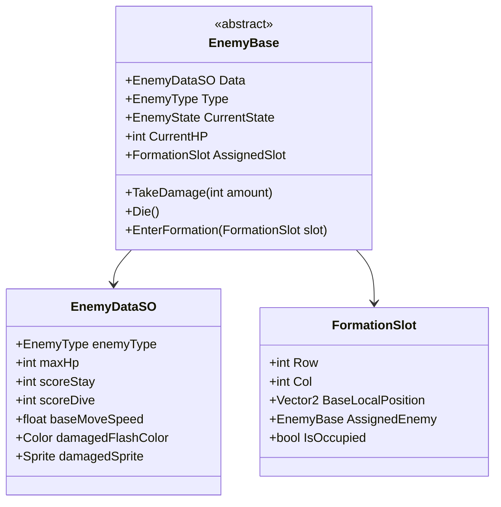

# [Tech Spec 02] 적 AI 및 레벨 디자인 기술 명세서 (Enemy AI & Level Design Tech Spec)

## 1. 적 기체 3종 스펙 및 데이터 구조

상단 편대는 총 40기(자코 20기, 고에이 16기, 보스 4기)로 구성되며, `EnemyDataSO` ScriptableObject를 통해 스펙이 데이터 주도(Data-Driven) 방식으로 관리됩니다.



### 1.1 적 3종 상세 스펙 정의

| 적 유형 | 체력 (HP) | 편대 수량 및 배치 | 피격 및 파괴 연출 | 점수 (대기 / 다이브) |
| :--- | :---: | :--- | :--- | :---: |
| **자코 (Zako - 청색)** | 1 | 20기 (하단 4열, 5열) | 1타 피격 시 즉시 폭발 (`PF_Explosion`) | 50점 / 100점 |
| **고에이 (Goei - 적색)** | 1 | 16기 (중단 2열, 3열) | 1타 피격 시 즉시 폭발 (`PF_Explosion`) | 80점 / 160점 |
| **보스 갤러그 (Boss - 녹색)** | 2 | 4기 (최상단 1열) | 1타 피격 시 청색 변색 플래시 유지, 2타 피격 시 대형 폭발 | 150점 / 400점 (호위기 동반 시 800~1600점) |
| **변신 적 (Special)** | 1 | 이벤트 스폰 (자코 3기 변신) | 1타 피격 시 즉시 폭발 | 100점 / 200점 (3기 완파 시 1000~3000점) |

### 1.2 피격 플래시 알고리즘 (`EnemyBase.cs`)
* 적 기체 피격 시 $0.15\text{초}$ 동안 흰색/피격색상으로 스프라이트 머티리얼 틴트가 변환된 후 원래 색상으로 복구됩니다.
* 보스 갤러그의 경우 `CurrentHP == 1`이 되면 기본 스프라이트/텍스처가 청색(Damaged) 스프라이트로 영구 교체됩니다.

---

## 2. 40기 5열 그리드 좌표계 및 호흡 애니메이션 (`FormationGridManager.cs`)

### 2.1 편대 그리드 슬롯 구조 (Grid Slot Map)
* **총 슬롯 수**: 40개 ($5\text{행} \times 8\text{열}$ 또는 $10\text{열}$ 가변 슬롯)
* **행별 배치 규격**:
  * **Row 0 (최상단, $Y = +6.0$)**: 보스 갤러그 4기 (중앙 열 4칸 차지)
  * **Row 1 ($Y = +4.8$)**: 고에이 8기
  * **Row 2 ($Y = +3.6$)**: 고에이 8기
  * **Row 3 ($Y = +2.4$)**: 자코 10기
  * **Row 4 (최하단, $Y = +1.2$)**: 자코 10기
* **슬롯 간격**: 수평 $\Delta X = 1.2 \text{ units}$, 수직 $\Delta Y = 1.2 \text{ units}$

### 2.2 호흡(Hovering / Breathing) 수학 알고리즘
그리드 전체가 좌우로 부드럽게 진동하며 수축 및 팽창을 수행합니다.
```csharp
public class FormationGridManager : MonoBehaviour
{
    [Header("Breathing Sine Parameters")]
    [SerializeField] private float _hoverFrequency = 1.5f;     // 좌우 진동 속도
    [SerializeField] private float _hoverAmplitudeX = 0.8f;    // 좌우 진동 폭 (units)
    [SerializeField] private float _expandFrequency = 0.75f;   // 편대 팽창 주기
    [SerializeField] private float _expandScaleFactor = 0.15f; // 수평 간격 팽창 계수

    private float _timeAccumulator = 0f;

    private void Update()
    {
        _timeAccumulator += Time.deltaTime;

        // 1. 편대 전체 좌우 이동 오프셋
        float globalOffsetX = Mathf.Sin(_timeAccumulator * _hoverFrequency) * _hoverAmplitudeX;

        // 2. 편대 열 간격 팽창/수축 배율
        float expansionScale = 1.0f + (Mathf.Sin(_timeAccumulator * _expandFrequency) * _expandScaleFactor);

        // 3. 각 슬롯 위치 실시간 업데이트
        for (int i = 0; i < _slots.Length; i++)
        {
            var slot = _slots[i];
            Vector2 basePos = slot.BaseLocalPosition;
            Vector2 animatedPos = new Vector2(
                (basePos.x * expansionScale) + globalOffsetX,
                basePos.y
            );
            slot.CurrentWorldPosition = (Vector2)transform.position + animatedPos;

            if (slot.AssignedEnemy != null && slot.AssignedEnemy.CurrentState == EnemyState.Formation)
            {
                slot.AssignedEnemy.transform.position = slot.CurrentWorldPosition;
            }
        }
    }
}
```

---

## 3. 5개 그룹 순차 진입 시퀀스 및 3차 베지어 엔진 (`EntranceSequenceManager.cs`)

### 3.1 3차 베지어 곡선 수학 수식 (`BezierCurve.cs`)
$$\mathbf{B}(t) = (1-t)^3 \mathbf{P}_0 + 3(1-t)^2 t \mathbf{P}_1 + 3(1-t) t^2 \mathbf{P}_2 + t^3 \mathbf{P}_3 \quad (0 \le t \le 1)$$
* **진행 방향 회전 각도 ($\theta$)**:
  $$\mathbf{v}_{tangent} = \frac{d\mathbf{B}(t)}{dt} = 3(1-t)^2(\mathbf{P}_1 - \mathbf{P}_0) + 6(1-t)t(\mathbf{P}_2 - \mathbf{P}_1) + 3t^2(\mathbf{P}_3 - \mathbf{P}_2)$$
  $$\theta = \text{atan2}(v_y, v_x) \times \frac{180}{\pi} - 90^\circ$$

### 3.2 5개 진입 웨이브 제어점 명세

| 그룹 | 기체 구성 | 스폰 지점 ($\mathbf{P}_0$) | 경유 제어점 ($\mathbf{P}_1, \mathbf{P}_2$) | 타겟 슬롯 ($\mathbf{P}_3$) |
| :--- | :--- | :--- | :--- | :--- |
| **Group 1 (8기)** | 보스 4 + 고에이 4 | 상단 중앙 $(0.0, 11.0)$ | $(0.0, 2.0) \rightarrow (-4.0, -2.0)$ 루프 선회 | Row 0 (보스), Row 1 중앙 (고에이) |
| **Group 2 (8기)** | 자코 8기 | 좌하단 $(-9.0, -5.0)$ | $(-2.0, 0.0) \rightarrow (4.0, 4.0)$ 8자 선회 | Row 3 좌측 (자코 8기) |
| **Group 3 (8기)** | 자코 8기 | 우하단 $(+9.0, -5.0)$ | $(+2.0, 0.0) \rightarrow (-4.0, 4.0)$ 8자 선회 | Row 4 우측 (자코 8기) |
| **Group 4 (8기)** | 고에이 8기 | 좌상단 $(-9.0, 8.0)$ | $(3.0, 3.0) \rightarrow (-3.0, -1.0)$ 루프 선회 | Row 2 전열 (고에이 8기) |
| **Group 5 (8기)** | 고에이 4 + 자코 4 | 우상단 $(+9.0, 8.0)$ | $(-3.0, 3.0) \rightarrow (3.0, -1.0)$ 루프 선회 | Row 1 외곽 (고에이), Row 4 외곽 (자코) |

* **진입 간격**: 각 기체 간 $0.15\text{초}$ 간격 스폰, 웨이브 간 $1.2\text{초}$ 딜레이.
* **진입 완료 트리거**: 40기 슬롯 안착 완료 시 `EnemyDiveController.StartAutoDive()` 호출.

---

## 4. 급강하 다이브 AI 및 조준탄 발사 메커니즘 (`EnemyDiveController.cs`)

### 4.1 다이브 상태 머신 (Enemy State Lifecycle)
```
[ Formation ] ──(Dive Trigger)──> [ DivePrep (이탈 회전) ]
                                          │
                                          ▼
[ Returning ] ◄──(화면 하단 통과)── [ Diving (급강하 & 사격) ]
      │
(상단 재진입 Y=11)
      │
      ▼
[ EnterFormation ] ──> [ Formation ]
```

### 4.2 실시간 플레이어 예측 다이브 궤적 생성
1. **시작점 ($\mathbf{P}_0$)**: 적 기체의 현재 편대 월드 좌표.
2. **상승 반동 제어점 ($\mathbf{P}_1$)**: $\mathbf{P}_0 + (0.0, +1.5\text{u})$ (위로 살짝 치솟는 아케이드 기동).
3. **플레이어 예측 조준점 ($\mathbf{P}_2$)**: 다이브 시점 플레이어 좌표 $(X_{player}, Y_{player} + 2.0\text{u})$.
4. **하단 이탈점 ($\mathbf{P}_3$)**: $(X_{player} \pm 2.0\text{u}, -11.0\text{u})$.

### 4.3 조준탄 사격 알고리즘 (`EnemyShooting.cs`)
* **발사 조건**: 다이브 진행도 $t \in [0.3, 0.6]$ 구간 도달 시 1회 사격 (난이도에 따라 2발 점사).
* **탄도 벡터 계산**:
  $$\mathbf{D} = \frac{\mathbf{P}_{player} - \mathbf{P}_{enemy}}{\|\mathbf{P}_{player} - \mathbf{P}_{enemy}\|}, \quad \mathbf{v}_{bullet} = \mathbf{D} \times V_{bullet}$$
* **재진입 루프**: 적 기체가 $Y < -10.5\text{u}$ 도달 시 즉시 $Y = +11.0\text{u}$로 순간이동하여 완만한 곡선으로 본래 배정된 `FormationSlot`으로 복귀.

---

## 5. 스테이지 루프 및 챌린징 스테이지 설계

### 5.1 스테이지 순환 규칙

| 스테이지 번호 | 유형 | 탄환 발사 | 특수 규칙 |
| :---: | :---: | :---: | :--- |
| **Stage 1 ~ 2** | 일반 | O | 기본 진입 및 단독 다이브 |
| **Stage 3** | **챌린징 1** | **X** | 5웨이브 40기 노탄환 통과, 40기 완파 시 **10,000점** |
| **Stage 4 ~ 6** | 일반 | O | 변신 적 등장, 3기 동시 다이브 |
| **Stage 7** | **챌린징 2** | **X** | 고속 곡선 궤적 40기 |
| **Stage 8 ~ 10** | 일반 | O | 보스 2기 + 호위 4기 합동 공격 |
| **Stage 11** | **챌린징 3** | **X** | 교차 루프 궤적 40기 |
| **Stage $4n - 1$** | **챌린징** | **X** | 매 4스테이지 주기 (Stage 15, 19, 23...) |

### 5.2 챌린징 스테이지 점수 정산 공식
$$\text{Bonus Score} = \begin{cases} 10,000 \text{ pts (PERFECT)}, & \text{if } \text{Kills} == 40 \\ \text{Kills} \times 100 \text{ pts}, & \text{if } \text{Kills} < 40 \end{cases}$$

---

## 6. 동적 난이도 랭크 시스템 (Dynamic Rank System)

### 6.1 랭크 산출 공식
$$\text{Rank}_{total} = \text{Mathf.Clamp}(\text{BaseStageRank} + \text{SurvivalRank} - \text{DeathPenalty}, \; 1, \; 32)$$
* $\text{BaseStageRank} = \text{CurrentStage} \times 2$
* $\text{SurvivalRank} = \lfloor \frac{\text{SurvivalSeconds}}{30} \rfloor$
* $\text{DeathPenalty} = \text{DeathCount} \times 3$

### 6.2 랭크별 동적 수치 테이블

| 랭크 구간 | 적 비행속도 (u/s) | 적 탄속 (u/s) | 최대 동시 다이브 수 | 다이브 쿨타임 (초) | 트랙터 빔 사용 확률 |
| :---: | :---: | :---: | :---: | :---: | :---: |
| **Rank 1 ~ 5** | $8.33 \text{ u/s}$ | $11.11 \text{ u/s}$ | 최대 2기 | $3.0\text{s}$ | $20\%$ |
| **Rank 6 ~ 15** | $12.50 \text{ u/s}$ | $15.28 \text{ u/s}$ | 최대 3기 | $1.8\text{s}$ | $50\%$ |
| **Rank 16 ~ 25** | $15.50 \text{ u/s}$ | $18.00 \text{ u/s}$ | 최대 4기 | $1.2\text{s}$ | $75\%$ |
| **Rank 26 ~ 32** | $17.36 \text{ u/s}$ | $20.83 \text{ u/s}$ | 최대 5기 | $0.8\text{s}$ | $90\%$ |
