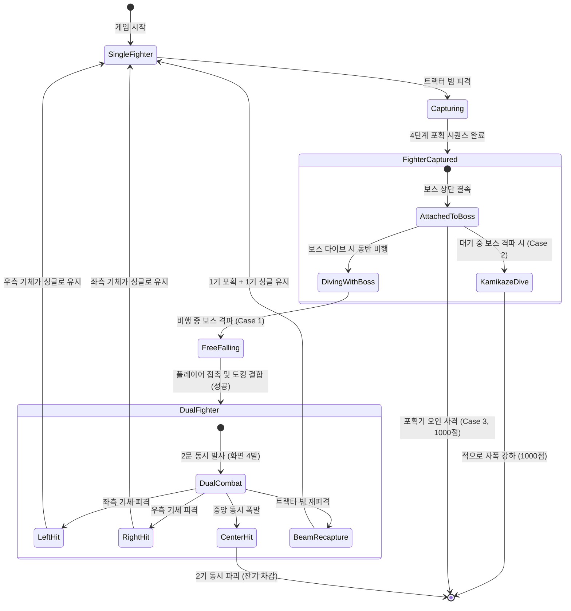
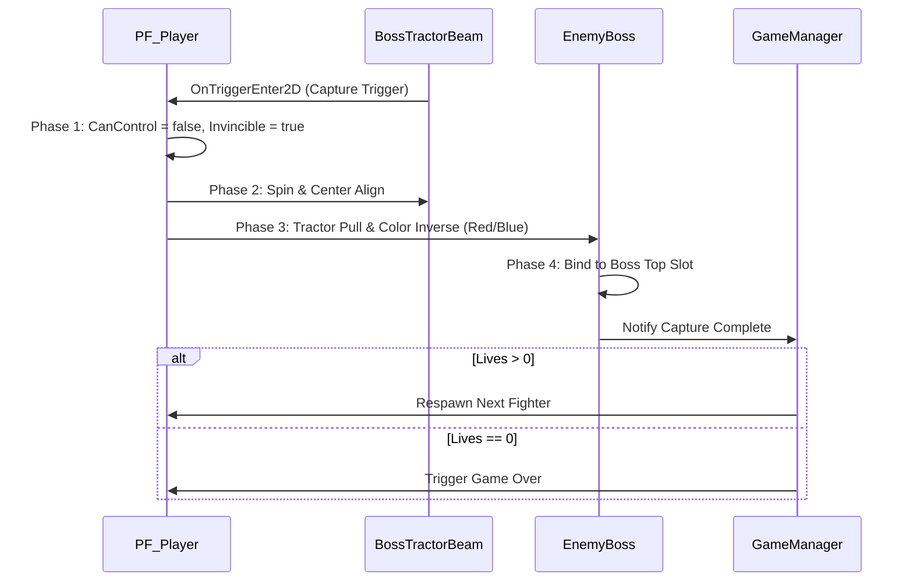

# [Tech Spec 03] 보스 트랙터 빔 및 듀얼 파이터 기술 명세서 (Boss Tractor Beam & Dual Fighter Tech Spec)

## 1. 개요 및 핵심 상태 다이어그램

본 문서는 Galaga의 핵심 차별화 요소인 보스 갤러그의 트랙터 빔(Tractor Beam) 포획 시퀀스, 3대 구출 분기 판정, 듀얼 파이터(Dual Fighter) 도킹 및 2배 화력/피격 분리 시스템을 C# 및 Unity 2D 환경에서 구현하기 위한 상세 기술 명세서입니다.



---

## 2. 보스 트랙터 빔 전개 및 영역 판정 (`BossTractorBeam.cs`)

### 2.1 다이브 및 빔 방출 시퀀스
1. **단독 다이브 진입**: 편대에 보스 갤러그가 1기 이상 존재하고, 현재 화면에 아군 포획기가 결속되어 있지 않은 경우 발동.
2. **호버링 정지 고도**: $Y = 0.0 \sim +2.0 \text{ units}$ (화면 중앙 상단)에 도달 시 베지어 비행을 일시 정지하고 수평 호버링 모드로 진입.
3. **트랙터 빔 콜라이더 전개**:
   * 형태: 역삼각형/사다리꼴 형태의 `PolygonCollider2D` (`isTrigger = true`).
   * **규격**:
     * 상단 너비: $8 \text{ px} = 0.556 \text{ units}$ (보스 갤러그 하단 배출구)
     * 하단 너비: $48 \text{ px} = 3.333 \text{ units}$ (플레이어 고도 $Y=-8.0$ 도달 영역)
     * 높이: $120 \text{ px} = 8.333 \text{ units}$ (보스 위치에서 플레이어 라인까지)
4. **시각 및 사운드 연출**:
   * 파란색, 하늘색, 백색이 교차 순환하는 $60\text{Hz}$ 텍스처 UV 스크롤/셰이더 애니메이션.
   * `SoundManager.Instance.PlayLoopSFX(SFXType.TractorBeamLoop)`.
5. **빔 지속 시간**: 약 $4.0\text{초}$ 동안 전개 후 포획 실패 시 빔을 거두고 하단으로 급강하 복귀.

---

## 3. 기체 포획 4단계 시퀀스 (`FighterCaptureController.cs`)

플레이어 기체가 트랙터 빔 콜라이더에 접촉(`OnTriggerEnter2D`)하면 다음 4단계 시퀀스가 즉시 실행됩니다:



### 3.1 단계별 세부 구현 명세
* **Phase 1: 조작권 즉시 상실 (0.0s ~ 0.2s)**
  * `PlayerController.CanMove = false`, `PlayerShooting.CanFire = false`.
  * 플레이어 기체의 수평 이동이 정지되고 빔의 중심 X좌표로 보간 이동 시작.
* **Phase 2: 회전 스핀 및 중심 정렬 (0.2s ~ 1.2s)**
  * Z축 $360^\circ$ 연속 회전 애니메이션 ($720^\circ/\text{s}$).
  * X좌표가 빔 중심축으로 완전 정렬되며 위로 서서히 끌려 올라감.
* **Phase 3: 상단 견인 및 색상 반전 (1.2s ~ 2.2s)**
  * 보스 갤러그의 상단 결속 슬롯 $(0.0, +0.8\text{u})$을 향해 상승.
  * 스프라이트가 아군 색상(흰색/빨간색)에서 **포획 상태 적 색상(빨간색/청색 틴트)**으로 교체.
* **Phase 4: 편대 결속 및 차기 기체 출격 (2.2s ~ 3.0s)**
  * 보스와 함께 상단 편대로 복귀하여 보스 슬롯 상단에 결속(`AttachedCapturedFighter`).
  * `PlayerHealth.CurrentLives--`, `OnLivesChanged` 발행.
  * `CurrentLives > 0`일 경우 하단 중앙에서 차기 기체 출격. `CurrentLives == 0`일 경우 게임 오버.

---

## 4. 3대 구출 분기 판정 로직 (`CapturedFighterRescueHandler.cs`)

포획기가 결속된 상태에서 플레이어의 사격 상황에 따라 3가지 분기가 엄격히 판정됩니다:

```csharp
public enum RescueBranch
{
    Case1_Success_FlyingBossDestroyed,   // 비행 중 보스 격파 -> 듀얼 합체 성공
    Case2_Failed_StationaryBossDestroyed, // 대기 중 보스 격파 -> 적 자폭 다이브
    Case3_Failed_FighterDestroyedDirectly // 포획기 직접 사격 -> 포획기 파괴
}
```

### 4.1 Case 1: 비행 중 보스 격파 (★ 듀얼 파이터 성공)
* **발동 조건**: 보스가 포획기를 상단에 매달고 하단으로 급강하 비행 중일 때 보스를 격파.
* **동작 시퀀스**:
  1. 보스 폭발 및 파괴 (`ScoreManager.AddScore(800 ~ 1600)`).
  2. 포획기가 구속에서 풀려나며 제자리에서 Z축 $180^\circ$ 회전하며 수직 하강 ($v_y = -3.0 \text{ u/s}$).
  3. 아군 색상(흰색/빨간색)으로 즉시 복구.
  4. 플레이어 기체와 충돌 감지 시 `DockDualFighter()` 트리거.
  5. 하단 이탈 시 화면 밖으로 사라짐 (구출 기회 소멸).

### 4.2 Case 2: 편대 대기 중 보스 격파 (구출 실패)
* **발동 조건**: 보스가 상단 편대 슬롯에 대기 중일 때 보스만 격파.
* **동작 시퀀스**:
  1. 보스 파괴 (150점).
  2. 포획기가 **완전한 적(Enemy)으로 전환**되어 경고음과 함께 플레이어를 향해 1회성 자폭 급강하 수행.
  3. 플레이어가 이를 요격하면 **1,000점** 획득. 요격하지 못하면 화면 밖으로 영구 이탈.

### 4.3 Case 3: 포획기 오인 사격 (구출 실패)
* **발동 조건**: 보스와 포획기가 결속되어 있는 상태에서 보스가 아닌 포획기에 플레이어 미사일이 명중.
* **동작 시퀀스**:
  1. 포획기 즉시 폭발 파괴 (`SFX_Enemy_Explode_S`).
  2. 오인 사격 격파 점수 **1,000점** 가산.
  3. 보스는 단독 상태로 전환되어 비행 계속.

---

## 5. 듀얼 파이터 도킹 및 전투 시스템 (`DualFighterController.cs`)

### 5.1 도킹 결합 시퀀스
* 포획기와 플레이어 기체가 접촉하면 접촉 위치(좌측/우측)에 따라 슬라이딩하여 대칭 도킹:
  * 좌측 접촉: 포획기가 좌측 날개 $(-0.45\text{u})$, 플레이어가 우측 날개 $(+0.45\text{u})$.
  * 우측 접촉: 플레이어가 좌측 날개 $(-0.45\text{u})$, 포획기가 우측 날개 $(+0.45\text{u})$.
* 도킹 완료 시 `SoundManager.Instance.PlaySFX(SFXType.DualDocking)` 재생.
* `PlayerShooting.SetDualFighter(true)`, `PlayerController.SetDualFighter(true)`.

### 5.2 듀얼 파이터 전투 사양

| 항목 | 싱글 파이터 | 듀얼 파이터 |
| :--- | :---: | :---: |
| **발사 총구 수** | 1문 (중앙) | **2문 (좌측 $-0.45\text{u}$, 우측 $+0.45\text{u}$)** |
| **1회 사격 시 탄환 수** | 1발 | **2발 동시 발사** |
| **화면 내 최대 탄환 수** | 2발 | **4발** |
| **AABB 히트박스 가로 크기**| $12 \text{ px} = 0.833 \text{ units}$ | **$26 \text{ px} = 1.806 \text{ units}$** |
| **이동 속도** | $10.42 \text{ units/sec}$ | $10.42 \text{ units/sec}$ (동일) |

### 5.3 듀얼 파이터 피격 및 분리 파이프라인

```csharp
public class DualFighterController : MonoBehaviour
{
    [SerializeField] private GameObject _leftFighterVisual;
    [SerializeField] private GameObject _rightFighterVisual;
    [SerializeField] private BoxCollider2D _dualCollider;

    public void OnHit(Vector2 hitWorldPosition)
    {
        float relativeX = hitWorldPosition.x - transform.position.x;

        if (relativeX < -0.2f)
        {
            // 좌측 기체 피격
            ExplosionManager.Instance.SpawnExplosion(_leftFighterVisual.transform.position, ExplosionType.Player);
            SplitToSingle(retainedSide: FighterSide.Right);
        }
        else if (relativeX > 0.2f)
        {
            // 우측 기체 피격
            ExplosionManager.Instance.SpawnExplosion(_rightFighterVisual.transform.position, ExplosionType.Player);
            SplitToSingle(retainedSide: FighterSide.Left);
        }
        else
        {
            // 중앙 직격 동시 피격
            ExplosionManager.Instance.SpawnExplosion(transform.position, ExplosionType.Player);
            DestroyBothFighters();
        }
    }

    private void SplitToSingle(FighterSide retainedSide)
    {
        // 듀얼 해제 및 남은 기체를 중앙으로 보간하여 싱글 파이터로 전환
        PlayerShooting.Instance.SetDualFighter(false);
        PlayerController.Instance.SetDualFighter(false);
        // ... 시각적 및 히트박스 원복
    }
}
```

### 5.4 듀얼 상태에서의 트랙터 빔 재피격
* 듀얼 파이터 상태에서 트랙터 빔에 닿을 경우:
  * 빔 중심에 가까운 **1기만 포획** 시퀀스로 진입.
  * 나머지 1기는 분리되어 즉시 **싱글 파이터 조작 유지** (플레이어가 끊김 없이 전투 계속 가능).
