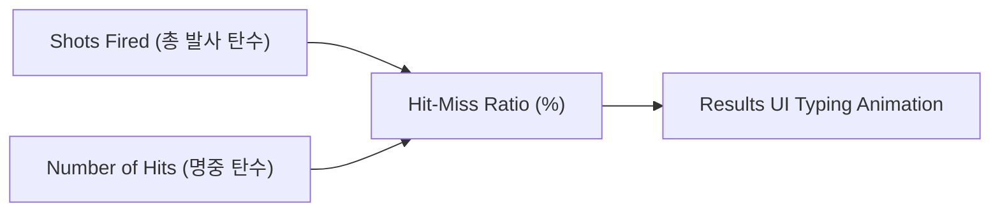

# [Tech Spec 04] HUD, 연출 및 사운드 기술 명세서 (HUD, Visual & Audio Tech Spec)

## 1. 224x288 3:4 HUD 레이아웃 아키텍처 (`HUDManager.cs`)

### 1.1 픽셀 퍼펙트 HUD 레이아웃 맵
Unity UI Canvas (Screen Space - Camera 또는 World Space, $224 \times 288$ 레퍼런스 해상도) 기준으로 배치됩니다.

```
┌────────────────────────────────────────────────────────┐ Y: 0 px (상단)
│  1UP               HIGH SCORE              2UP         │
│  002400              035000               000000       │ Y: 16 px
├────────────────────────────────────────────────────────┤
│                                                        │
│                                                        │
│                 [ 2D 게임 플레이 영역 ]                 │
│                 (3단계 스타필드 배경)                  │
│                                                        │
│                                                        │
├────────────────────────────────────────────────────────┤ Y: 272 px
│  ▲ ▲ ▲                                         ⚑ ⚑ ⭐ │
│ [잔여 기체 3기]                          [Stage 70 뱃지]│ Y: 288 px (하단)
└────────────────────────────────────────────────────────┘
```

### 1.2 HUD 데이터 바인딩 컴포넌트

```csharp
public class HUDManager : MonoBehaviour
{
    [Header("Top Score Text Elements")]
    [SerializeField] private TextMeshProUGUI _txt1UpScore;
    [SerializeField] private TextMeshProUGUI _txtHighScore;
    [SerializeField] private TextMeshProUGUI _txt2UpScore;

    [Header("Bottom Indicators")]
    [SerializeField] private Transform _livesIconContainer;
    [SerializeField] private GameObject _lifeIconPrefab;
    [SerializeField] private Transform _stageBadgeContainer;
    [SerializeField] private StageBadgeRenderer _badgeRenderer;

    private void Start()
    {
        ScoreManager.Instance.OnScoreChanged += Update1UpScore;
        ScoreManager.Instance.OnHighScoreChanged += UpdateHighScore;
        PlayerHealth.Instance.OnLivesChanged += UpdateLivesDisplay;
        StageManager.Instance.OnStageChanged += UpdateStageBadges;
    }

    private void Update1UpScore(int score) => _txt1UpScore.text = score.ToString("D6");
    private void UpdateHighScore(int high) => _txtHighScore.text = high.ToString("D6");
    private void UpdateLivesDisplay(int lives)
    {
        // 현재 조작 기체 제외 대기 기수 표시 (최대 5개 아이콘)
        int reserveLives = Mathf.Max(0, lives - 1);
        // ... 아이콘 활성화/풀링 갱신
    }
    private void UpdateStageBadges(int stage) => _badgeRenderer.RenderBadges(stage);
}
```

---

## 2. 스테이지 조합형 뱃지 렌더링 시스템 (`StageBadgeRenderer.cs`)

하단 우측 공간에 스테이지 번호를 최소 개수의 뱃지 심볼로 조합하여 표현하는 탐욕 알고리즘(Greedy Algorithm)입니다.

### 2.1 뱃지 심볼 가치 및 우선순위

| 뱃지 종류 (Badge Type) | 가치 (Value) | 스프라이트 리소스 ID | 렌더링 우선순위 |
| :--- | :---: | :--- | :---: |
| **금색 대형 깃발 (Gold Flag)** | **50** | `SP_Badge_Flag_Gold` | 1순위 |
| **청색 대형 깃발 (Blue Flag)** | **30** | `SP_Badge_Flag_Blue` | 2순위 |
| **적황 대형 별 (Red Star)** | **20** | `SP_Badge_Star_Red` | 3순위 |
| **백색 대형 별 (White Star)** | **10** | `SP_Badge_Star_White` | 4순위 |
| **적황 쉐브론 (Chevron)** | **5** | `SP_Badge_Chevron_Yellow` | 5순위 |
| **청색 리본 (Ribbon)** | **1** | `SP_Badge_Ribbon_Blue` | 6순위 |

### 2.2 뱃지 분할 알고리즘
```csharp
public class StageBadgeRenderer : MonoBehaviour
{
    private static readonly (int Value, BadgeType Type)[] BadgeHierarchy = new[]
    {
        (50, BadgeType.GoldFlag),
        (30, BadgeType.BlueFlag),
        (20, BadgeType.RedStar),
        (10, BadgeType.WhiteStar),
        (5,  BadgeType.Chevron),
        (1,  BadgeType.Ribbon)
    };

    public List<BadgeType> CalculateBadges(int stageNumber)
    {
        var result = new List<BadgeType>();
        int remainder = stageNumber;

        foreach (var (value, type) in BadgeHierarchy)
        {
            while (remainder >= value)
            {
                result.Add(type);
                remainder -= value;
            }
        }
        return result;
    }
}
```

---

## 3. 3단계 패럴랙스 우주 배경 (Parallax Starfield)

### 3.1 레이어별 물리/시각 파라미터

| 레이어 | 입자/별 크기 | 색상 팔레트 | 표준 스크롤 속도 | 워프 가속 속도 |
| :--- | :---: | :--- | :---: | :---: |
| **Layer 1 (원경 / Far)** | $1 \text{ px}$ ($0.07\text{u}$) | 짙은 청색, 다크 그레이 | $15 \text{ px/s} = 1.04 \text{ u/s}$ | $10.0 \text{ u/s}$ |
| **Layer 2 (중경 / Mid)** | $1.5 \text{ px}$ ($0.10\text{u}$) | 백색, 은은한 황색 | $30 \text{ px/s} = 2.08 \text{ u/s}$ | $20.0 \text{ u/s}$ |
| **Layer 3 (근경 / Near)** | $2.0 \text{ px}$ ($0.14\text{u}$) | 밝은 백색, 적색 반짝임 | $60 \text{ px/s} = 4.17 \text{ u/s}$ | $40.0 \text{ u/s}$ |

### 3.2 패럴랙스 스크롤 및 워프 구현 (`ParallaxStarfield.cs`)
* 3개의 Quad Mesh UV Offset 또는 `ParticleSystem` 3개 레이어로 구성.
* 스테이지 클리어 시 1.5초간 $3\sim 5$배 속도로 가속하여 성간 이동(Warp) 연출 수행.

---

## 4. 게임 오버 결과 통계 화면 (Results Screen)

게임 오버 시 플레이어의 슈팅 기록을 정밀 집계하여 출력합니다.



### 4.1 통계 산출 공식 (`ResultsManager.cs`)
$$\text{Hit-Miss Ratio (\%)} = \begin{cases} \left(\frac{\text{Number of Hits}}{\text{Shots Fired}} \times 100\right), & \text{if } \text{Shots Fired} > 0 \\ 0.0\%, & \text{if } \text{Shots Fired} == 0 \end{cases}$$

### 4.2 결과 화면 렌더링 텍스트 포맷
```
- - - - - - - - RESULTS - - - - - - - -

SHOTS FIRED                 01250
NUMBER OF HITS              00980
HIT-MISS RATIO             78.4 %
```
* 각 항목은 $0.5\text{초}$ 간격으로 한 줄씩 타이핑되며 카운트업 오디오 틱음 재생.

---

## 5. BGM 및 SFX 오디오 매핑 사양 (`SoundManager.cs`)

### 5.1 BGM 5종 매핑표

| BGM 식별자 | 발생 이벤트 / 재생 시점 | 루프 여부 | 길이 / 특성 |
| :--- | :--- | :---: | :--- |
| `BGM_Game_Start` | 코인 투입 후 최초 게임 시작 시 | 1회 | 4.0초 경쾌한 아르페지오 멜로디 |
| `BGM_Challenging_Stage` | 챌린징 스테이지(Stage 3, 7...) 진입 시 | 1회 | 2.5초 긴장감 있는 팡파르 |
| `BGM_Stage_Clear` | 40기 전멸 완료 시 | 1회 | 1.8초 상승 톤 클리어 차임 |
| `BGM_Perfect_Bonus` | 챌린징 스테이지 40기 완파 시 | 1회 | 3.0초 화려한 축하 징글 |
| `BGM_Game_Over` | 잔기 0 사망 후 결과 화면 진입 시 | 루프 | 감성적이고 여운을 남기는 짧은 루프 |

### 5.2 SFX 8종 매핑표

| SFX 식별자 | 발생 트리거 | 채널/풀 크기 | 사운드 특성 (Pitch / Synthesis) |
| :--- | :--- | :---: | :--- |
| `SFX_Laser_Fire` | 플레이어 미사일 발사 | 4 채널 | 고주파 사각파(Square Wave) 하강 톤 |
| `SFX_Enemy_Explode_S` | 자코 / 고에이 격파 | 6 채널 | 화이트 노이즈 기반 숏 크런치 사운드 |
| `SFX_Enemy_Explode_L` | 보스 갤러그 격파 | 2 채널 | 저주파 럼블 + 복합 폭발 사운드 |
| `SFX_Tractor_Beam_Loop`| 트랙터 빔 전개 중 | 1 채널 (Loop) | 진동 펄스 / 사이렌 루프음 |
| `SFX_Fighter_Captured` | 기체 포획 완료 시 | 1 채널 | 서글픈 하강 아르페지오 시퀀스 |
| `SFX_Dual_Docking` | 듀얼 파이터 도킹 결합 | 1 채널 | 힘찬 상승 2화음 팡파르 |
| `SFX_Extend_Life` | 2만/7만 익스텐드 달성 | 1 채널 | 맑고 높은 피치의 벨/코인 차임 |
| `SFX_Enemy_Dive` | 적 급강하 개시 시 | 3 채널 | 곤충 날개짓 느낌의 워블(Wobble) 톤 |
